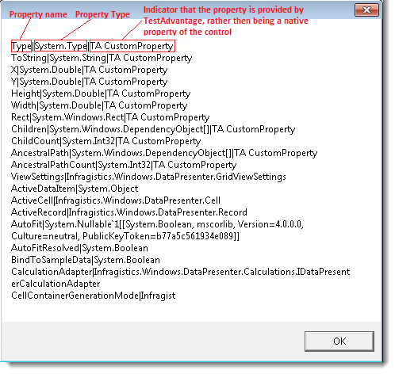
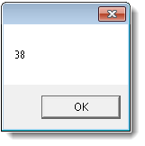
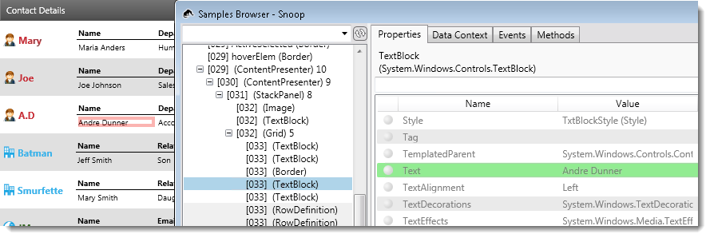
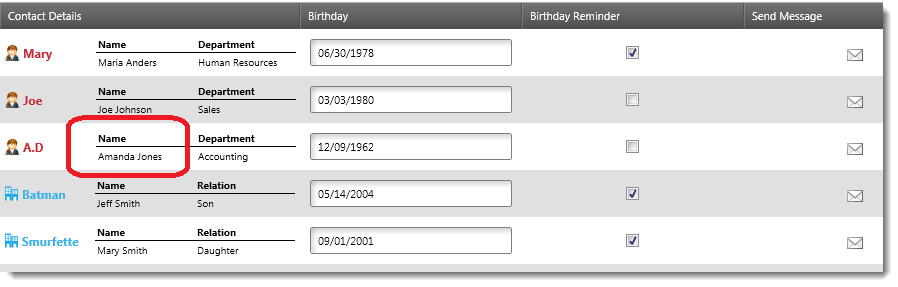

////
|metadata|
{
    "name": "accessing-controls-properties",
    "controlName": [],
    "tags": [],
    "guid": "e4c38ad0-fd23-40a3-9660-4d57a4546b6e",
    "buildFlags": [],
    "createdOn": "2012-06-26T17:26:40.0744843Z"
}
|metadata|
////

= Accessing Controls' Properties

== Topic Overview

=== Purpose

This topic provides reference information about the methods for accessing the properties and sub-properties of Infragistics controls.

=== In this topic

This topic contains the following sections:

* <<_Ref328506559,Property Access Summary>>
* <<_Ref328588082,Controls’ Properties Access Methods>>

** <<_Ref326919172, _GetNAProperties_  >>
** <<_Ref328565945, _GetNAProperty_  >>
** <<_Ref328566245, _GetSubItemProperties_  >>
** <<_Ref328566329, _GetSubItemProperty_  >>
** <<_Ref328566333, _SetNAProperty_  >>
** <<_Ref327434581, _SetSubItemProperty_  >>

* <<_Ref328407898,Related Content>>

[[_Ref328506559]]
[[_Ref328483346]]
== Property Access Summary

=== Property access summary chart

The following table maps the property access tasks with respective the Test Automation methods that implement them.

[options="header", cols="a,a"]
|====
|In order to…|Use this method…

|[[_Hlk328588011]] 

Retrieve the value of a (sub-)property of the control
|_link:{ApiPlatform}test.shared~infragisticswpf.test.shared.recordreplayproxybase~getnaproperty.html[GetNAProperty]_

|Retrieve the value of a (sub-)property of a sub-item of the control
|_link:{ApiPlatform}test.shared~infragisticswpf.test.shared.recordreplayproxybase~getsubitemproperty.html[GetSubItemProperty]_

|Retrieve a listing of the visible properties of a control
|_link:{ApiPlatform}test.shared~infragisticswpf.test.shared.recordreplayproxybase~getnaproperties.html[GetNAProperties]_

|Retrieve a listing of the visible properties of a sub-item of the control
|_link:{ApiPlatform}test.shared~infragisticswpf.test.shared.recordreplayproxybase~getsubitemproperties.html[GetSubItemProperties]_

|Set the value of a (sub-)property of the control
|_link:{ApiPlatform}test.shared~infragisticswpf.test.shared.recordreplayproxybase~setnaproperty.html[SetNAProperty]_

|Set the value of a (sub-)property of a sub-item of the control
|_link:{ApiPlatform}test.shared~infragisticswpf.test.shared.recordreplayproxybase~setsubitemproperty.html[SetSubItemProperty]_

|====

[[_Ref328588082]]
== Controls’ Properties Access Methods

=== Controls’ properties access methods summary chart

The following table briefly explains the methods for accessing the properties and sub-properties of Infragistics controls. The *Operation level* column of the table indicates whether the method operates on the control as a whole, at the control operational level, for example, on the whole grid, or on some of its parts (sub-item operational level), for example, a cell of the grid. Detailed information about the methods is provided in the text blocks following the table.

The accessibility of each method is specific to the control that is calling the method. For details, please refer to the documentation of the respective control, the *Testable User Actions and Elements* topic.

[options="header", cols="a,a,a"]
|====
|Method|Operation level|Description

| _<<Ref326919172, GetNAProperties >>_ 
|control
|Returns a list of the visible properties of the specified control or object and their data type.

| _<<Ref328565945, GetNAProperty >>_ 
|control
|Returns the value of a property or sub-property of the specified control.

| _<<Ref328566333, SetNAProperty >>_ 
|control
|Sets the value of a property or sub-property of the specified control.

| _<<Ref328566245, GetSubItemProperties >>_ 
|sub-item
|Returns a list of the visible properties of a sub-item of the specified control.

| _<<Ref328566329, GetSubItemProperty >>_ 
|sub-item
|Returns the value of a property or sub-property sub-item of the specified control.

| _<<Ref327434581, SetSubItemProperty >>_ 
|sub-item
|Sets the value of a sub-item property or sub-property of the specified control.

|====

[[_GetNAProperties_Method]]
[[_Ref326919172]]
== _GetNAProperties_

=== Description

A utility method, GetNAProperties returns a list of the visible properties of the specified control or object and their data type.

=== Details

In the returned list of properties, the custom-defined  _Test Automation_   properties are explicitly indicated.

The returned string value uses a carriage return linefeed (/n) to separate each property and a pipe (|) delimiter between the name, data type, and custom property indicator.

=== Parameters

The following table explains the method’s parameters.

[options="header", cols="a,a"]
|====
|Method Parameter|Description

|oFullPropertyName
|The name of the property whose sub-properties will be returned. 

When left BLANK (default), the method returns the control-level properties.

|====

=== Examples

*Example 1*

Calling the GetNAProperties method on a  _xamDataGrid_   and displaying the results in a message box:

props=WpfWindow("MainWindow").XamDataGrid("grid").GetNAProperties

msgbox props *Example 2* W __riting the results of the__  GetNAProperties  __method, called on a__   _xamGrid_    __to a text file,__   _xamGrid_Props.txt_   __:__  __fileName = "C:\xamGrid_Props.txt"__  __SET grid = WpfWindow("Test Automation Samples").XamGrid("xamGrid1")__  __SET fso = CreateObject("Scripting.FileSystemObject")__  __SET myFile = fso.CreateTextFile( fileName, true )__  __strProps = grid.GetNAProperties("")__  __aryProps = SPLIT(strProps, vbCRLF)__  __FOR index = 0 to UBOUND(aryProps)__  __aryProp = Split(aryProps(index), "|")__   __FOR index2 = 0 to UBOUND(aryProp)__  __myFile.Write(aryProp(index2) & vbTab)__  __NEXT__   __myFile.WriteLine()__  __Next__  __myFile.Close()__  *Example 3* 

Calling the GetNAProperties method, passing the oFullPropertyName parameter with value  _ViewSettings_   and returning a list of the object grid’s ViewSettings properties in a message box.

props=WpfWindow("MainWindow").XamDataGrid("grid").GetNAProperties (“ViewSettings”)msgbox props

[[_GetNAProperty_Method]]
[[_SetNAProperty_Method]]
[[_Ref328565945]]
== _GetNAProperty_

=== Description

This method returns the value of a property or sub-property of the specified control.

=== Supported controls

All Ultimate UI for WPF controls.

=== Parameters

The following table explains the method’s parameters.

[options="header", cols="a,a"]
|====
|Method Parameter|Description

|sFullPropertyName
|This string represents the fully-qualified name of the property whose value is being retrieved.

|====

=== Illustration

The images below show a  _xamRadialGauge_   and a message box with the  _xamRadialGauge’s_   value returned from the GetNAProperty method.

=== Example

Retrieving the value displayed in the  _xamRadialGauge_  .

The  _xamRadialGauge_   has a Scales property, which is available in the list returned by GetNAProperties. The Scales property contains a collection of Scale objects, which, in turn, have a collection of Needle objects.

Set gauge = WpfWindow("Window1").XamRadialGauge("myGauge")

msgbox gauge.GetNAProperty ("Scales[0].Needles[0].Value")

[[_Ref328566245]]
== _GetSubItemProperties_

=== Description

A utility method, GetSubItemProperties returns a list of the visible properties of a sub-item of the specified control.

=== Details

This method returns a list consisting of all the property names of the specified sub-item, their data types, and a flag signaling that the property is a custom-defined Test Automation property. The string returned by this method uses a carriage return linefeed (/n) to separate each property and a pipe (|) delimiter between the name, data type, and custom property indicator.

=== Supported Controls

* xamDataPresenter
** xamDataCards
** xamDataCarousel
** xamDataGrid

* xamGrid

=== Parameters

The following table describes the method’s parameters.

[options="header", cols="a,a"]
|====
|Method Parameter|Description

|oeSubItemType
|Specifies the type of sub-item that the properties belong to (for example, a grid cell).

|oSubItem
|Uniquely identifies the sub-item whose properties are being retrieved.

|oFullPropertyName
|The name of the property whose sub-properties will be returned. 

When left BLANK (default), the method returns the SUBITEM-level properties.

|====

=== Examples

*Example 1*

Getting the value of a specific property of a sub-item.

The following code gets the properties of the third grid cell in the Contact Details column. The oeSubItemType value of “xGrdCell” was chosen from the Intellisense enumeration. The identifier `{2}[ContactInfo],` which is passed in the oSubItem parameter, can be obtained by various means, including the UFT Object Spy. The optional parameter oFullPropertyName is not used.

The method displays the results in a message box:

Set grid = WpfWindow(“Samples Browser”).XamGrid(“dataGrid”)

msgbox grid.GetSubItemProperties(xGrdCell,”{2}[ContactInfo]”)

*Example 2*

Getting the list of sub-properties of a specific property of a sub-item.

By providing the optional oFullPropertyName parameter, you will get a list of that property’s sub-properties. In the code below, “Value” gets passed as oFullPropertyName resulting in a list of the sub-properties of the cell’s Value property.

Set grid = WpfWindow(“Samples Browser”).XamGrid(“dataGrid”)

[[_Ref328566329]]
== _GetSubItemProperty_

=== Description

This method returns the value of a property or sub-property sub-item of the specified control (for example, a row’s property in a grid control).

=== Supported controls

* link:{ApiPlatform}test.datapresenter~infragisticswpf.test.datapresenter-namespace.html[xamDataPresenter]
** xamDataCards
** xamDataCarousel
** xamDataGrid

* link:{ApiPlatform}test.controls.grids.xamgrid~infragisticswpf.test.controls.grids-namespace.html[xamGrid]

=== Parameters

The following table explains the method’s parameters.

[options="header", cols="a,a"]
|====
|Method Parameter|Description

|oeSubItemType
|Specifies the type of sub-item that the retrieved property belongs to (for example, a grid cell).

|oSubItem
|Uniquely identifies the sub-item whose property is being retrieved.

|sFullPropertyName
|The fully-qualified name of the property whose value is being retrieved. 

you with the full property name.

|====

=== Example

This example uses the third-party tool Snoop depicting the Text property of a FrameworkElement in the  _xamGrid_  ’s visual tree.

Retrieving the name ( *“Andre Dunner”)*  from the highlighted cell.

Set grid = WpfWindow("Samples Browser").XamGrid("dataGrid")

contactName = grid.GetSubItemProperty( xGrdCell, "{2}[ContactInfo]","ContentElement.Children[0].Children[2].Children[3].Text")

The parameter values used in the code snippet above are as follows:

* `oeSubItemType = xGrdCell` (an enumeration value specific to the xamGrid)
* `oSubItem = ”{2}[ContactInfo]”` (identifier of the cell, as retrieved from UFT Object Spy)
* `sFullPropertyName = “ContentElement.Children[0].Children[2].Children[3].Text`” (“ContentElement” is a custom property provided by Test Automation to return the ContentPresenter of the grid cell. A third party tool like Snoop is useful to view the visual tree and locate the property’s full name.

[[_Ref328566333]]
== _SetNAProperty_

=== Description

This method sets the value of a property or sub-property of the specified control.

=== Supported controls

All Ultimate UI for WPF controls.

=== Parameters

The following table explains the method’s parameters.

[options="header", cols="a,a"]
|====
|Method Parameter|Description

|sFullPropertyName
|The fully-qualified name of the property whose value is to be set.

|oNewValue
|The new value to which the property will be set.

|====

=== Examples

*Example 1*

Setting the value of a  _xamRadialGauge_   called  _myGauge_   to 50:

Set gauge = WpfWindow("Window1").XamRadialGauge("myGauge")

gauge.SetNAProperty "Scales[0].Needles[0].Value", 50

*Example 2* (not using oFullPropertyName)

The following code gets the properties of the third grid cell in the Contact Details column. The oeSubItemType value of “xGrdCell” was chosen from the Intellisense enumeration. The identifier `{2}[ContactInfo],` which is passed in the oSubItem parameter, can be obtained by various means, including the UFT Object Spy.

The method displays the results in a message box:

Set grid = WpfWindow(“Samples Browser”).XamGrid(“dataGrid”)

msgbox grid.GetSubItemProperties(xGrdCell,”{2}[ContactInfo]”)

*Example 3*  (using oFullPropertyName)

By providing the optional oFullPropertyName parameter, you will get a list of that property’s sub-properties. In the code below, “Value” gets passed as oFullPropertyName resulting in a list of the sub-properties of the cell’s Value property.

Set grid = WpfWindow(“Samples Browser”).XamGrid(“dataGrid”)

msgbox grid.GetSubItemProperties(xGrdCell,”{2}[ContactInfo]”,”Value”)

[[_GetSubItemProperties_Method]]
[[_Ref327434581]]
== _SetSubItemProperty_

=== Description

This method sets the value of a sub-item property or sub-property of the specified control (for example, a row’s property in a grid control).

=== Supported controls

* xamDataPresenter
** xamDataCards
** xamDataCarousel
** xamDataGrid

* xamGrid

=== Parameters

The following table explains the method’s parameters.

[options="header", cols="a,a"]
|====
|Method Parameter|Description

|oeSubItemType
|This parameter specifies the type of sub-item to which the property being set belongs (for example, a grid cell).

|oSubItem
|This parameter uniquely identifies the sub-item whose property is being set.

|sFullPropertyName
|This parameter is a string, which represents the fully-qualified name of the property whose value is being set.

|oNewValue
|This parameter is the value to which the property will be set.

|====

=== Example

This example uses the third-party tool Snoop depicting the Text property of a FrameworkElement in the  _xamGrid_  ’s visual tree.

Setting the name in the highlighted cell to the new value,  *“Amanda Jones”* .

Set grid = WpfWindow("Samples Browser").XamGrid("dataGrid")

grid.SetSubItemProperty xGrdCell, "{2}[ContactInfo]","ContentElement.Children[0].Children[2].Children[3].Text","Amanda Jones"

(Refer to Illustration above for results.)

[[_Ref328407898]]
== Related Content

=== Topics

The following topics provide additional information related to this topic.

[options="header", cols="a,a"]
|====
|Topic|Purpose

|_ link:panning-and-zooming.html[Panning and Zooming]_
|This topic provides reference information about the methods for emulating of panning and zooming actions on Infragistics controls.

|_ link:emulating-the-mouse.html[Emulating the Mouse]_
|This topic provides reference information about the methods for mouse action emulation on Infragistics controls.

|_ link:setting-focus.html[Setting the Focus of the Application]_
|This topic provides reference information about the methods for setting the mouse focus in the application directly (without emulating any mouse or key actions).

|====