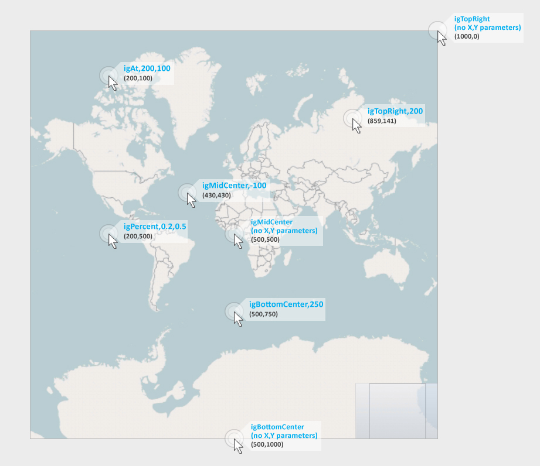
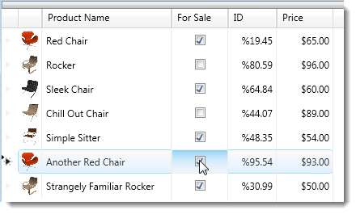
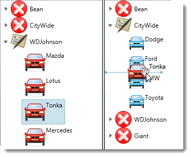

////

|metadata|
{
    "name": "emulating-the-mouse",
    "controlName": [],
    "tags": [],
    "guid": "1621e4f6-f495-46d9-8bcb-b38ee4bf259a",  
    "buildFlags": [],
    "createdOn": "2012-06-27T15:45:58.9472104Z"
}
|metadata|
////

= Emulating the Mouse

== Topic Overview

=== Purpose

This topic provides reference information about the methods for mouse action emulation on Infragistics controls.

=== In this topic

This topic contains the following sections:

* <<_Ref328483346,Supported Mouse Actions Summary>>
* <<_Ref328483390,Mouse Action Emulation Methods>>

** <<_Ref326919172, _ClickControl_  >>
** <<_Ref328523447, _ClickSubItem_  >>
** <<_Ref328523605, _DblClickControl_  >>
** <<_Ref328523612, _DblClickSubItem_  >>
** <<_Ref328523618, _MouseActionOnControl_  >>
** <<_Ref328523624, _MouseActionOnSubItem_  >>
** <<_Ref328523633, _RightClickControl_  >>
** <<_Ref328483575, _RightClickSubitem_  >>

* <<_Ref328407898,Related Content>>

[[_Ref328506559]]
== Supported Mouse Actions Summary

=== Supported mouse actions summary chart

The following table maps the supported user mouse actions to the Test Automation methods that emulate them. Some actions are supported by two methods depending on whether the action is performed on the entire control, for example, on the whole grid, or on some of its parts, like a cell of the grid. (See <<_Ref328483390,Mouse Action Emulation Methods Summary>>.)

[options="header", cols="a,a"]
|====
|Mouse action|Method

|Left-click
| _<<Ref326919172, ClickControl >>_  

 _<<Ref328523447, ClickSubItem >>_  

 _<<Ref328523618, MouseActionOnControl >>_  

 _<<Ref328523624, MouseActionOnSubItem >>_ 

|Double-click
| _<<Ref328523605, DblClickControl >>_  

 _<<Ref328523612, DblClickSubItem >>_  

 _<<Ref328523618, MouseActionOnControl >>_  

 _<<Ref328523624, MouseActionOnSubItem >>_ 

|Right-click
| _<<Ref328523633, RightClickControl >>_  

 _<<Ref328483575, RightClickSubItem >>_  

 _<<Ref328523618, MouseActionOnControl >>_  

 _<<Ref328523624, MouseActionOnSubItem >>_ 

|Mouse down
| _<<Ref328523618, MouseActionOnControl >>_  

 _<<Ref328523624, MouseActionOnSubItem >>_ 

|Mouse up
| _<<Ref328523618, MouseActionOnControl >>_  

 _<<Ref328523624, MouseActionOnSubItem >>_ 

|Mouse move
| _<<Ref328523618, MouseActionOnControl >>_  

 _<<Ref328523624, MouseActionOnSubItem >>_ 

|====

[[_Ref328483390]]
== Mouse Action Emulation Methods

=== Mouse action emulation methods summary chart

The following table briefly explains the methods for emulating user mouse actions. The  *Operation level*  column of the table indicates whether the method operates on the control as a whole, at the control operational level, for example, on the whole grid, or on some of its parts (sub-item operational level), for example, a cell of the grid. Detailed information about the methods is provided in the text blocks following the table.

The accessibility of each method is specific to the control that is calling the method. For details, please refer to the documentation of the respective control, the *Testable User Actions and Elements* topic.

[options="header", cols="a,a,a"]
|====
|Method|Operation level|Description

| _<<Ref326919172, ClickControl >>_ 
|control
|Performs a left-click on the control.

| _<<Ref328523447, ClickSubItem >>_ 
|sub-item
|Performs a left-click on a specified sub-item of the control.

| _<<Ref328523612, DblClickControl >>_ 
|control
|Performs a double-click on the control.

| _<<Ref328523612, DblClickSubItem >>_ 
|sub-item
|Performs a double-click on a sub-item of the control.

| _<<Ref328523618, MouseActionOnControl >>_ 
|control
|Performs one of several mouse actions on the control. Including: left-click, double-click, right-click, mouse down, mouse up, mouse move.

| _<<Ref328523624, MouseActionOnSubItem >>_ 
|sub-item
|Performs one of several Mouse actions on a sub-item of the control. Including: left-click, double-click, right-click, mouse down, mouse up, mouse move.

| _<<Ref328523633, RightClickControl >>_ 
|control
|Performs a right-click on the control.

| _<<Ref328483575, RightClickSubItem >>_ 
|sub-item
|Performs a right-click on a sub-item of the control.

|====

[[_Ref326919172]]
== _ClickControl_

=== Description

The  _ClickControl_   method performs a left-click on the control.

=== Supported controls

All Infragistics controls.

[[_Ref328401729]]

=== Parameters

The following table explains the method’s parameters.

[options="header", cols="a,a"]
|====
|Method Parameter|Description

|oRegion 

_(required)_
|Specifies the reference point in the control relative to which the click will occur. 

The allowed enumerated values are: 

* igAt 

* igBottomCenter 

* igBottomLeft 

* igBottomRight 

* igMidCenter 

* igMidLeft 

* igMidRight 

* igPercent 

* igTopCenter 

* igTopLeft 

* igTopRight 

|oDouble1
|Depending on the value of oRegion, is either a number representing the x-coordinate of the mouse click location or the distance of the click from the oRegion.

|oDouble2
|A number representing the y-coordinate of the mouse click location.

|====

=== Examples

The following image presents the mouse click locations used in the examples. The size of the  _xamGeographicMap_   control is 1000x1000 pixels. The ClickControl parameters are shown in blue, and the location’s x-,y-coordinates – in black.

*Example 1*

Clicking at the x-y coordinates (200,305) on the  _xamDataChart_  :

WpfWindow("MainWindow").XamDataChart("chart").ClickControl igAt, 200, 305 *Example 2* 

Clicking the top right corner of the  _xamGeographicMap_  :

WpfWindow("MainWindow").XamGeographicMap("map").ClickControl igTopRight *Example 3* 

Clicking a point 200 pixels inside the top right corner of a 1000x1000  _xamGeographicMap_  :

WpfWindow("MainWindow").XamGeographicMap("map").ClickControl igTopRight, 200 *Example 4* 

Clicking the middle of the  _xamGeographicMap_  :

WpfWindow("MainWindow").XamGeographicMap("map").ClickControl igMidCenter *Example 5* 

Clicking a point 100 pixels diagonally away from the middle (toward the upper left corner) on a 1000x1000  _xamGeographicMap_  :WpfWindow("MainWindow").XamGeographicMap("map").ClickControl igMidCenter, 100

*Example 6*

Clicking a point 20% from the left margin and 50% from the top of the  _xamGeographicMap_  :

WpfWindow("MainWindow").XamGeographicMap("map").ClickControl igTopRight

[[_Ref328523447]]
== _ClickSubItem_

=== Description

The  _ClickSubItem_   method emulates a mouse click on a control’s specific sub-item.

=== Supported controls

* link:{ApiPlatform}test.datapresenter~infragisticswpf.test.datapresenter-namespace.html[xamDataPresenter]

** xamDataCards
** xamDataCarousel
** xamDataGrid

* link:{ApiPlatform}test.controls.grids.xamgrid~infragisticswpf.test.controls.grids-namespace.html[xamGrid]

[[_Parameters]]

=== Parameters

The following table explains the method’s parameters.

[options="header", cols="a,a"]
|====
|Method Parameter|Description

|oeSubItemType
|Specifies the type of sub-item that the click will occur on (for example, a grid cell).

|oSubItem
|Uniquely identifies the sub-item on which the click will occur.

|oRegion 

_(required)_
|Specifies a reference point in the sub-item relative to which the click will occur. 

The allowed enumerated values are: 

* igAt 

* igBottomCenter 

* igBottomLeft 

* igBottomRight 

* igMidCenter 

* igMidLeft 

* igMidRight 

* igPercent 

* igTopCenter 

* igTopLeft 

* igTopRight 

|oDouble1
|Depending on the value of oRegion, this is either a number representing the x-coordinate of the mouse click location or the distance of the click from the oRegion.

|oDouble2
|Number representing the y-coordinate of the mouse click’s location.

|====

=== Example

Clicking a grid cell to toggle the checked state of a checkbox in the cell.

In this example, the oeSubItemType parameter value is gridCell and the oSubItem parameter value is the string, {5}[ForSale], which specifies the row by index and the column by key.

WpfWindow("MainWindow").XamDataGrid("grid").ClickSubItem gridCell,"{5}[ForSale]",igMidCenter

(Refer to Illustration above.)

[[_Ref328523605]]
== _DblClickControl_

=== Description

The DblClickControl method performs a double-click action on the control.

=== Supported controls

All Infragistics controls.

=== Parameters

The  _DblClickControl_   method has the same parameters as the <<_Ref326919172, _ClickControl_  >>.

[[_Ref328523612]]
== _DblClickSubItem_

=== Description

The  _DblClickSubItem_   method performs a double-click on a sub-item of the control.

=== Supported controls

* xamDataPresenter

** xamDataCards
** xamDataCarousel
** xamDataGrid

* xamGrid

=== Parameters

The  _DblClickSubItem_   method has the same parameters as the <<_Ref328523447, _ClickSubItem_  >>.

[[_Ref328523618]]
== _MouseActionOnControl_

=== Description

The  _MouseActionOnControl_   method performs the following mouse actions on a specified location on the control:

* Left-click
* Double-click
* Right-click
* Mouse down
* Mouse up
* Mouse move

=== Details

As the  _MouseActionOnControl_   method supports several different mouse actions, the exact action to perform is specified with a parameter. (For details, see <<_Ref328574696,Parameters>>.)

=== Supported controls

All Infragistics controls.

[[_Ref328574696]]

=== Parameters

The following table explains the method’s parameters.

[options="header", cols="a,a"]
|====
|Method Parameter|Description

|oeMouseAction 

_(required)_
|Specifies the mouse action that will occur. 

The allowed enumerated values are: 

* igAt 

* igBottomCenter 

* igBottomLeft 

* igBottomRight 

* igMidCenter 

* igMidLeft 

* igMidRight 

* igPercent 

* igTopCenter 

* igTopLeft 

* igTopRight 

|oRegion _(required)_ 
|Specifies a reference point in the control relative to which the mouse action will occur.

|oDouble1
|Depending on the value of oRegion, this is either a number representing the x-coordinate of the mouse action location or the distance of the mouse action from the oRegion.

|oDouble2
|Number representing the y-coordinate of the mouse action location.

|====

=== Example

Replaying a user’s dragging the mouse to zoom action into the  _xamDataChart_  . The zoom rectangle, generated by this move starts 10 pixels above and to the left of the middle of the chart and ends 50 pixels above and to the left of the bottom right corner.

image::images/TAWPF_Direct_Mouse_Manipulation_3.png[]

Set chart=WpfWindow("MainWindow").XamDataChart("chart1")

chart1.MouseActionOnControl igMouseDown, igMidCenter, -10

chart1.MouseActionOnControl igMouseMove, igBottomRight, 50

[[_Ref328523624]]
== _MouseActionOnSubItem_

=== Description

The  _MouseActionOnSubItem_   method performs the following mouse actions on a sub-item of the specified control:

* Left-click
* Double-click
* Right-click
* Mouse down
* Mouse up
* Mouse move

=== Details

As the  _MouseActionOnSubItem_   method supports several different mouse actions, the exact action to perform is specified with a parameter. (For details, see <<_Ref328574538,Parameters>>.)

=== Supported controls

* xamDataPresenter
** xamDataCards
** xamDataCarousel
** xamDataGrid

* xamGrid

[[_Ref328574538]]

=== Parameters

The following table explains the method’s parameters.

[options="header", cols="a,a"]
|====
|Method Parameter|Description

|oeMouseAction 

_(required)_
|Specifies the mouse action that will occur (for example, mouse move). 

The allowed enumerated values are: 

* igClick 

* igDblClick 

* igMouseDown 

* igMouseMove 

* igMouseUp 

* igRightClick 

|oeSubItemType 

_(required)_
|Specifies the type of sub-item that the mouse action will occur on (for example, a grid cell).

|oSubItem 

_(required)_
|Uniquely identifies the sub-item upon which the mouse action will occur.

|oRegion 

_(required)_
|Specifies a reference point in the sub-item relative to which the mouse action will occur. 

The parameter oRegion, which is required by this method, must have one of the following enumerated values: 

* igAt 

* igBottomCenter 

* igBottomLeft 

* igBottomRight 

* igMidCenter 

* igMidLeft 

* igMidRight 

* igPercent 

* igTopCenter 

* igTopLeft 

* igTopRight 

|oDouble1
|Depending on the value of oRegion, this is either a number representing the x-coordinate of the mouse action location or the distance of the action from the oRegion.

|oDouble2
|A number representing the y-coordinate of the mouse action location.

|====

=== Example

This example demonstrates how to emulate a drag-drop operation that moves a tree node  _Tonka_   from one  _xamDataTree_   to another.

In the example, there are three calls specifying igMouseMove. While it is not always necessary to implement all three calls, this is the recommended approach. Your actual requirements vary depending on how the application itself implements the drag-drop function. The following is the recommended approach, using three calls:

* one igMouseMove call inside the source sub-item, at a point differing by at least 3 pixels from the starting point
* one igMouseMove call external to the source sub-item, but inside the starting control
* one igMouseMove call inside the target sub-item, but differing from the end point by at least three pixels

Set left_tree = WpfWindow("MainWindow").XamDataTree("xamTree1")

Set right_tree = WpfWindow("MainWindow").XamDataTree("xamTree2")

left_tree.MouseActionOnSubItem igMouseDown,treeNode, ARRAY("WDJohnson", "Tonka")

left_tree.MouseActionOnSubItem igMouseMove,treeNode, ARRAY("WDJohnson", "Tonka"),igMidCenter,5

left_tree.MouseActionOnControl igMouseMove,igMidRight

right_tree.MouseActionOnSubItem igMouseMove,treeNode, ARRAY("CityWide", "BMW"),igTopCenter,3

right_tree.MouseActionOnSubItem igMouseUp,treeNode, ARRAY("CityWide", "BMW") ,igTopCenter

[[_Ref328523633]]
== _RightClickControl_

=== Description

The  _RightClickControl_   method performs a right-click on the control.

=== Supported controls

All Infragistics controls.

=== Parameters

The  _RightClickControl_   method has the same parameters as the <<_Ref326919172, _ClickControl_  >>.

[[_Ref328483553]]

[[_Ref328483575]]
== _RightClickSubItem_

=== Description

The  _RightClickSubItem_   method performs a right-click on a sub-item of the control.

=== Supported controls

* xamDataPresenter

** xamDataCards
** xamDataCarousel
** xamDataGrid

* xamGrid

=== Parameters

The  _RightClickSubItem_   method has the same parameters as the <<_Ref328523447, _ClickSubItem_  >>.

[[_Ref328483585]]

[[_Ref328407898]]
== Related Content

=== Topics

The following topics provide additional information related to this topic.

[options="header", cols="a,a"]
|====
|Topic|Purpose

| link:accessing-controls-properties.html[Accessing Controls' Properties]
|This topic provides reference information about the methods for accessing the properties and sub-properties of Infragistics controls.

| link:panning-and-zooming.html[Panning and Zooming]
|This topic provides reference information about the methods for emulating of panning and zooming actions on Infragistics controls.

| link:setting-focus.html[Setting the Focus of the Application]
|This topic provides reference information about the methods for setting the application’s focus directly on a control (without emulating any mouse or key actions).

|====