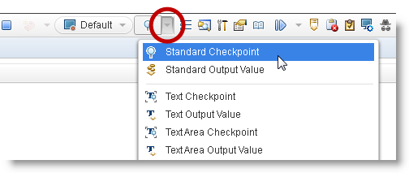
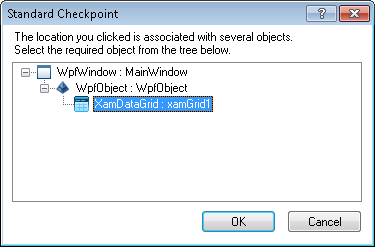
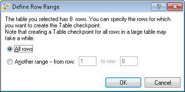
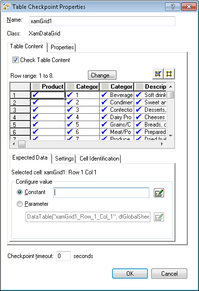
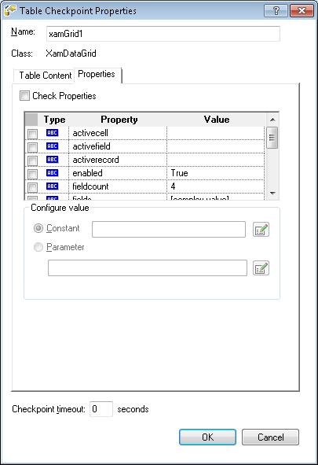

////
|metadata|
{
    "name": "inserting-standard-checkpoint",
    "controlName": [],
    "tags": [],
    "guid": "dfab6a87-cc1e-4904-b9f9-fbb2e4dfa054",
    "buildFlags": [],
    "createdOn": "2013-11-20T22:00:53.8773737Z"
}
|metadata|
////

= Inserting Table Checkpoint

== Topic Overview

=== Purpose

This topic demonstrates using QTP/UFT in WPF to insert a table checkpoint.

=== In this topic

This topic contains the following sections:

* <<_Ref372556312,Table Checkpoint Supported Controls>>
* <<_Ref372556321,Inserting Table Checkpoint>>

[[_Ref372556312]]
== Table Checkpoint Supported Controls

=== Overview

Controls that implement  _ITableVerify_   interface support table checkpoints, which are used to verify the cell data within table. The following is the list of Ultimate UI for WPF controls supporting table checkpoints with {ProductName}.

*  _xamColorPicker_  
*  _xamComboEditor_  
*  _xamDataChart_  
*  _xamDataPresenter_  
*  _xamDataTree_  
*  _xamDiagramToolbox_  
*  _xamDoughnutChart_  
*  _xamGantt_  
*  _xamGeographicMap_  
*  _xamGrid_  
*  _xamMonthCalendar_  
*  _xamMenu_  
*  _xamNetworkNode_  
*  _xamOutlookBar_  
*  _xamPropertyGrid_  
*  _xamRibbon_  
*  _xamSparkline_  
*  _xamSpreadsheet_  
*  _xamTabControl_  

[[_Ref372556321]]
== Inserting Table Checkpoint

=== Steps

The screenshots provided in these steps may differ from your application as they are based on an existing sample application for demonstration purposes.

[start=1]
. Create a new test using the Micro Focus Unified Functional Testing application, and start recording.

[start=2]
. While recording press `F12` on the keyboard or use the “Insert Checkpoint” dropdown and select “Standard Checkpoint”.

[start=3]
. Bring the mouse pointer (Hand) over to the control (running project) and click on it.

The first popup window shows the control selected, in this case `XamDatGrid: [name of the grid]`. Click Ok.

[start=4]
. If the control supports `ITableVerify`, you will see a “Defined Row Range” window. By default, all rows are defined. The following screenshot illustrates this, as the  _XamDataGrid_   does support `ITableVerify`.

[start=5]
. The following screenshot illustrate the “Table Checkpoint Properties” window with two tabs  *Table Content*  (selected by default) and  *Properties* .

*Properties*  tab view of the “Table Checkpoint Properties” displays the editable checkpoint properties.

