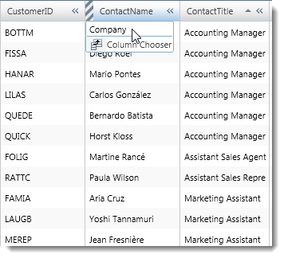
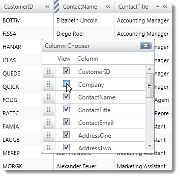
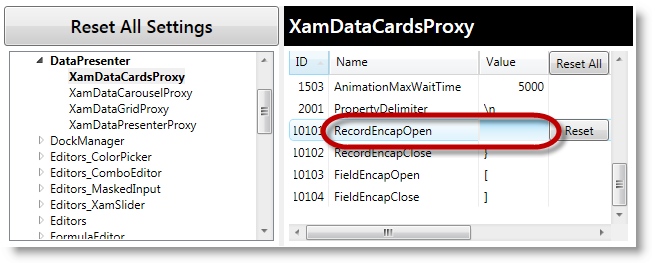
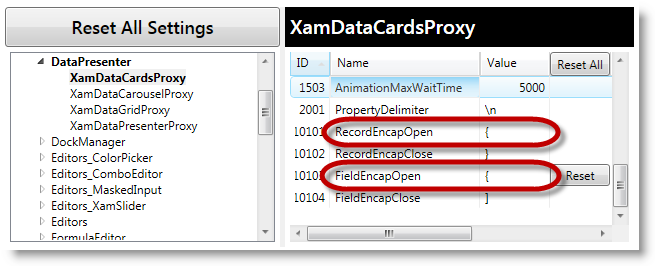
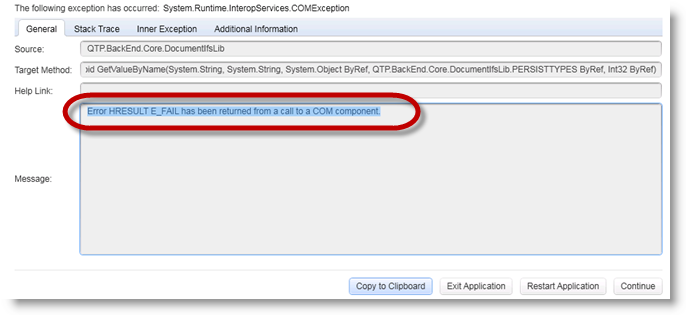
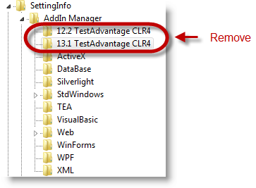

////
|metadata|
{
    "name": "known-issues-and-breaking-changes-2013-volume-1",
    "controlName": [],
    "tags": [],
    "guid": "2650b275-fbe2-4215-80a4-2e92783bd08b",
    "buildFlags": [],
    "createdOn": "2012-02-01T17:16:29.402946Z"
}
|metadata|
////

= 2013 Volume 1

== Topic Overview

=== Purpose

This topic provides information on the currently known issues and limitations related to {ProductName} Unified Functional Testing. These issues will be addressed in future releases of the product.

=== In this topic

This topic contains the following sections:

* <<_Ref315605288,Known Issues and Limitations>>

** <<_Ref315857500,The ShowColumn method does not record in QTP>>
** <<_Ref315857510,Replay Operation>>
** <<_Ref315857520,Incorrect Replaying of a Test on a xamContextMenu Application>>
** <<_Ref316309006,Inserting a Standard Checkpoint for grouped data fails in scripts for xamDataPresenter control>>
** <<_Ref316309391,Incorrect Recording of xamRibbon Drop-down or Menu Selected Items>>
** <<_Ref316309016,Test Recording Fails on a xamTagCloud Application>>
** <<_Ref355169852,UFT Records an additional click on right-click action>>
** <<_Ref355169923,UFT prevents you from opening the existing scripts or creating new scripts>>

* <<_Ref315857230,Related Topics>>

'''

[[_Ref315605288]]
== Known Issues and Limitations

=== Issues / Limitations chart

The table below briefly describes the known issues/limitations of the {ProductName} Unified Functional Testing Volume {ProductVersion} release. Detailed explanations and the possible workarounds are provided for all of the issues in the blocks following the table.

Legend:

image:images/Yes.png[]
– workaround

image:images/No.png[]
– no known workaround

image:images/Fix.png[]
– fix planned

[options="header", cols="a,a,a,a"]
|====
|*Control*|*Issue*|*Description*|*Resolved?*

|xamGrid
|<<_Ref315857500,The ShowColumn method does not record in QTP>>
|Showing a hidden column by selecting its name in the hidden columns menu does not get recorded. It should record a ShowColumn method call.
|<<_Solution_Workaround_010, 
image:images/Yes.png[Solution / Workaround] 
>> 
image:images/Fix.png[]

|
|<<_Ref315857510,Replay operation>>
|Replay operations fail whenever any of the RecordEncapOpen, RecordEncapClose, FieldEncapOpen or FieldEncapClose strings is empty or the RecordEncapOpen and FieldEncapOpen strings are identical.
|<<_Solution_Workaround_020, 
image:images/Yes.png[Solution / Workaround] 
>>

|xamContextMenu
|<<_Ref315857520,Incorrect Replaying of a Test on a xamContextMenu Application>>
|Replaying a test on a xamContextMenu is incorrect when the control’s Name property is not set.
|<<_Solution_Workaround_030, 
image:images/Yes.png[Solution / Workaround] 
>>

|xamDataPresenter
|<<_Ref316309006,Inserting a Standard Checkpoint for grouped data fails in scripts for xamDataPresenter control>>
|When inserting a Standard Checkpoint for verifying grouped data, an exception is thrown that the Checkpoint cannot be created.
|<<_Solution_Workaround_040, 
image:images/Yes.png[Solution / Workaround] 
>>

|xamDataPresenter

xamDataGrid

xamDataCards

xamDataCarousel

|<<_Ref315857510,Replay operation>>
|Replay operations fail whenever any of the RecordEncapOpen, RecordEncapClose, FieldEncapOpen or FieldEncapClose strings is empty or the RecordEncapOpen and FieldEncapOpen strings are identical.
|<<_Solution_Workaround_020, 
image:images/Yes.png[Solution / Workaround] 
>>

|xamRibbon
|<<_Ref316309391,Incorrect recording of xamRibbon drop-down or menu selected items>>
|The drop-down or menu selected items are recorded incorrectly. They are recorded as WpfMenu and/or WpfObject.
|<<_Solution_Workaround_050, 
image:images/Yes.png[Solution / Workaround] 
>>

|xamTagCloud
|<<_Ref316309016,Test Recording Fails on a xamTagCloud Application>>
|The test recording and application fail when the tag items are created dynamically by setting the control’s ItemsSource property.
|<<_Solution_Workaround_060, 
image:images/Yes.png[Solution / Workaround] 
>>

|All WPF Controls
|<<_Ref355169852,UFT Records an additional click on right-click action>>
|UFT records an additional _Click_ action when recording a Right Click against Ultimate UI for WPF controls.
|<<_Solution_Workaround_070, 
image:images/Yes.png[] 
>> 
image:images/Fix.png[]

|All WPF Controls
|<<_Ref355169923,UFT prevents you from opening the existing scripts or creating new scripts>>
|UFT prevents you from opening the existing or creating new scripts after using *Version-Free* assemblies.
|<<_Solution_Workaround_080, 
image:images/Yes.png[] 
>> 
image:images/Fix.png[]

|====

'''

[[_Ref315857500]]
== The ShowColumn method does not record in QTP

=== Issue description

Showing a hidden column by selecting its name in the hidden columns menu does not get recorded. It should record a ShowColumn method call.

An example of the hidden column menu affected by this issue is shown below:

[[Solution_Workaround_010]]

=== Solution / workaround

There are two workarounds for this issue:

1. Code the ShowColumn method call by hand in the script. For example:

Set grid=WpfWindow("MyApp").XamGrid("MyGrid")

grid.ShowColumn "[Company]"

2. Use the Column Chooser Dialog to show the hidden column. This alternate way of showing the hidden column will record properly. An example of the Column Chooser Dialog is shown below:

'''

[[_Ref315857510]]
== Replay Operation

=== Issue description

Encountering any of the following scenarios will cause the replay operation to fail.

1. When any of the following settings is empty:

*  _RecordEncapOpen_  
*  _RecordEncapClose_  
*  _FieldEncapOpen_  
*  _FieldEncapClose_  

2. When the  _RecordEncapOpen_   proxy setting is the same as the  _FieldEncapOpen_   setting.

For example,  _XamDataCards_   sample uses these proxy settings. If any of the previously stated scenarios and conditions is true, actions using these settings such as  _ExpandCard_  ,  _SelectionAdded_  ,  _ActivateRecord_  , and  _ActivateCell_   will fail.

[[Solution_Workaround_020]]

=== Solution / workaround

To ensure successful replay action confirm that any one of the  _RecordEncapOpen, RecordEncapClose, FieldEncapOpen or FieldEncapClose_   strings is not blank and that the  _RecordEncapOpen_   and  _FieldEncapOpen_   settings are unique from one another.

'''

[[_Ref315857520]]
== Incorrect Replaying of a Test on a xamContextMenu Application

=== Issue description

Replaying a test on a xamContextMenu control application may be incorrect.

[[Solution_Workaround_030]]

=== Solution / workaround

A xamContextMenu Name property value must be set.

'''

[[_Ref316309006]]
== Inserting a Standard Checkpoint for grouped data fails in scripts for xamDataPresenter control

=== Issue description

When inserting a Standard Checkpoint for verifying grouped xamDataPresenter data, an exception is thrown that the Checkpoint cannot be created because the Table Content section of the Checkpoint displays only flat data (not grouped and hierarchical data).

[[Solution_Workaround_040]]

=== Solution / workaround

After grouping the records, expand the group-by record and activate an internal record in that group.

'''

[[_Ref316309391]]
== Incorrect Recording of xamRibbon Drop-down or Menu Selected Items

=== Issue description

The recording of selected menu or drop-down items of a xamRibbon control may be incorrect. The WpfMenu and/or WpfObject are recorded instead.

[[Solution_Workaround_050]]

=== Solution / workaround

Before replaying the test script, remove the incorrect recordings.

'''

[[_Ref316309016]]
== Test Recording Fails on a xamTagCloud Application

=== Issue description

Recording a test on a xamTagCloud control application may cause the application to crash due to an issue in the control code. This happens when the tag items are created dynamically by setting the control’s  _ItemsSource_  property.

[[Solution_Workaround_060]]

=== Solution / workaround

The control bug is fixed in the latest Ultimate UI for WPF Service release so to solve this automation issue you need to upgrade your application to use the latest Infragistics service release build.

'''

[[_Ref355169852]]
== UFT Records an additional click on right-click action

=== Issue

When using {ProductName} Unified Functional Testing, the UFT records an additional  _Click_   action when recording a  _Right-Click_   against Ultimate UI for WPF controls.

During replay, the UFT plays the script as recorded, extraneous  _Right-Click_   action and all resulting, in errors and unintended results.

[[Solution_Workaround_070]]

=== Solution / Workaround

You need to inspect and manually remove all of the extraneous recorded  _Click_   actions from your script.

[[_Ref355169923]]
== UFT prevents you from opening the existing scripts or creating new scripts

=== Issue

When using  _Test Automation WPF_    *version-free*  assemblies with UFT, it may cause an unexpected behavior in UFT preventing you from opening the existing or creating new scripts. This behavior will return with the exception as illustrated in the following screen shot.

==== Exception:

`Error HRESULT E_FAIL has been returned from a call to a COM component.`

[[Solution_Workaround_080]]

=== Solution / Workaround

With UFT closed, using the Registry Editor (RegEdit.exe) remove every key with Test Automation in its name under the following key:

_HKEY_CURRENT_USER\Software\Mercury Interactive\QuickTest Professional\MicTest\SettingInfo\AddIn Manager_

[[_Ref315857230]]
== Related Topics

=== Related topics summary chart

The following table lists other topics you may find useful.

[options="header", cols="a,a"]
|====
|*Topic*|*Purpose*

| link:supported-environment.html[Supported Environments and Product Versions]
|This topic describes the supported environment and QuickTest Professional product versions supported by {ProductName}.

| link:getting-help-for-test-automation-wpf.html[Getting Help for {ProductName}]
|This topic explains the available options for getting help with your Infragistics product and how to prepare for contacting technical support.

| link:installing-configuring-removing-ta-wpf.html[Installing, Configuring and Removing {ProductName}]
|This section contains information about: 

* How to install and configure the {ProductName} product 

* How to switch between different CLR versions and different product versions 

* How to remove the {ProductName} product 

| link:test-automation-for-infragistics-controls.html[Test Automation for Infragistics Controls]
|The topics below provide reference information about the verifiable properties and the recordable and replay-only methods for testing the Ultimate UI for WPF controls.

|====

'''