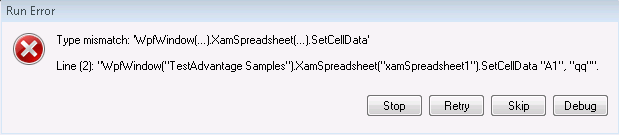

////
|metadata|
{
    "name": "known-issues-and-breaking-changes-2014-volume-2",
    "controlName": [],
    "tags": [],
    "guid": "15f80409-2a8d-4eb0-8362-2bd13dfdedcd",
    "buildFlags": [],
    "createdOn": "2014-11-19T11:59:14.3774129Z"
}
|metadata|
////

= 2014 Volume 2

== Known Issues and Limitations

=== Known issues and limitations summary

This topic provides information on the currently known issues and limitations related to {ProductName} Unified Functional Testing. These issues will be addressed in future releases of the product.

== Known Issues and Limitations Summary

=== Known issues and limitations summary chart

The table below briefly describes the known issues/limitations of the {ProductName} Unified Functional Testing Volume {ProductVersion} release. Detailed explanations and the possible workarounds are provided for all of the issues in the blocks following the table.

Legend:

 – workaround

 – no known workaround

 – fix planned

==== xamSpreadsheet

[options="header", cols="a,a,a"]
|====
|Issue|Description|Status

|Replay operation throws exception
|This was due to the lack of a UIAutomationPeer in the RTM build of the xamSpreadsheet control. As of the first SR build of the control[Not TestAutomation] (14.2.2024) the UIAutomationPeer was added.
|image::images/Yes.png[]

|Standard Checkpoint is failing
|When multiple cells are selected for a Standard checkpoint, the table verification is failing.
|image::images/Yes.png[]

|Some UI actions not recorded
|As of the release of 14.2 the following UI actions are not supported: 

* Moving the FormulaBar splitter 

* Moving the Sheet Area splitter 

* Moving the SplitPane splitter 

* In cell font formatting 

|image::images/Fix.png[]

|====

==== xamPropertyGrid

[options="header", cols="a,a,a"]
|====
|Issue|Description|Status

|Reset button not being recorded
|When clicked on the reset button no action is recorded.
|image::images/Yes.png[] 

|====

[[_Ref367305775]]

== xamSpreadsheet

=== Replay operation throws exception

The following exception “Type mismatch: …” is thrown during replay.

You may have noticed that this only happens when you close the AUT after recording and re-open the application on replay.

This happens when testing against the RTM version of the 14.2 IG xamSpreadsheet control. This is due to the fact that the RTM version of the control did not have a UIAutomationPeer defined for the control. This was added in the first service release, build 14.2.2024.

Workaround

.Note
[NOTE]
====
Build you AUT with the IG WPF xamSpreadsheet build of 14.2.2024 or later.
====

=== Standard Checkpoint is failing

This is likely due to the cells that were selected during record, were not selected on replay before the Standard CheckPoint table verification. To understand why this is an issue there are several things that must be understood:

* The TableVerification is based only on the ActiveSelection.ActiveCellRange
* To limit the excessive recording of SelectCells every time the selection changes we only record the SelectCells when data is changing or being copied on multiple cells.
* We cannot trigger a record of a SelectCells action in response to a CheckPoint call.

Workaround

.Note
[NOTE]
====
Either record a NameSelection prior to the StandardCheckpoint, which will in turn record a SelectCells for the current selection. Or hand script a SelectCells action corresponding to the Cells that you want to be verified.
====

=== Some UI actions not recorded

Because of the number of large controls included in the release of IG WPF control suite 14.2, some features were dropped from RTM support in IG TestAutomation so that it may be released in a timely manner. Support for these actions will be added in a later release.

[[_Ref367305781]]

== xamPropertyGrid

=== Reset button not being recorded

UFT\QTP is partially intercepting our recording operations against the context menu of the control. We are working to resolve this behavior but at this time this issue has not been resolved.

Workaround

.Note
[NOTE]
====
Manually script a PerformCommand prpgResetPropertyValue after selecting the property.
====