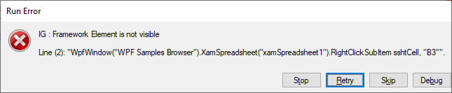

////
|metadata|
{
    "name": "known-issues-and-breaking-changes-2018-volume-2",
    "controlName": [],
    "tags": [],
    "guid": "15f80409-2a8d-4eb0-8362-2bd13dfdedcd",
    "buildFlags": [],
    "createdOn": "2014-11-19T11:59:14.3774129Z"
}
|metadata|
////

= 2018 Volume 2

== Known Issues and Limitations

=== Known issues and limitations summary

This topic provides information on the currently known issues and limitations related to {ProductName} Unified Functional Testing. These issues will be addressed in future releases of the product.

[[_Ref367305775]]

== xamSpreadsheet

=== Replay operation throws exception

The following exception “IG: Framework Element is not visible: …” is thrown during replay.

====