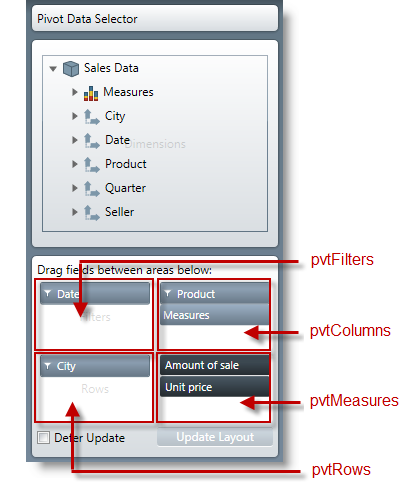

////

|metadata|
{
    "name": "olapviewmodel-enumeration-reference",
    "controlName": [],
    "tags": [],
    "guid": "46e7b901-cd04-4a84-9ebe-256c8034e6e5",  
    "buildFlags": [],
    "createdOn": "2012-10-29T21:25:31.533123Z"
}
|metadata|
////

= OlapViewModel - Enumeration Reference

== Topic Overview

=== Purpose

This topic provides reference information about the common enumerations in the  _OlapViewModel_    __proxy__ .

=== In this topic

This topic contains the following sections:

* <<_Ref321412912,OlapViewModel Test Object Enumerations Summary>>
* <<_Ref338172812,Related Content>>

[[_Ref338233193]]
== OlapViewModel Test Object Enumerations Summary

=== Enumerations reference summary chart

The following table summarizes the purpose of the  _OlapViewModel_   test object enumerations, used with most recordable methods, to define which  _xamPivotDataSelector™_   item performs the user interaction.

[options="header", cols="a,a,a"]
|====
|Enumeration|Items|Description

|_PivotAreaNames_
|pvtMeasures = 0 

pvtFilters = 1 

pvtRows = 2 

pvtColumns = 3
|Use this enumeration with the _oSourcePivotAreaName_ and _oTargetPivotAreaName_ to define the allowable pivot area names.

|_OlapViewModelSelectableItemType_
|pvtArea = 4 

pvtAreaItem = 5
|This enumeration represents the sub item types and their associated values.

|====

[[_Ref338172812]]
== Related Content

=== Topics

The following topics provide additional information related to this topic.

[options="header", cols="a,a"]
|====
|Topic|Purpose

| link:olapviewmodel-manipulating-data-at-runtime.html[OlapViewModel - Manipulating Data at Runtime]
|This topic provides conceptual overview on how the controls that use _OlapViewModel_, manipulate data at runtime.

| link:olapviewmodel-property-refreence.html[OlapViewModel - Property Reference]
|This topic provides reference information about the test object properties of the controls that use _OlapViewModel_ .

| link:olapviewmodel-testable-user-actions-and-elements.html[OlapViewModel - Testable User Actions and Elements]
|This topic provides information about the testable user actions and elements of the controls that use _OlapViewModel_ .

|====