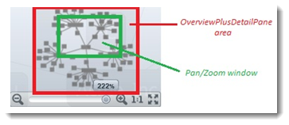
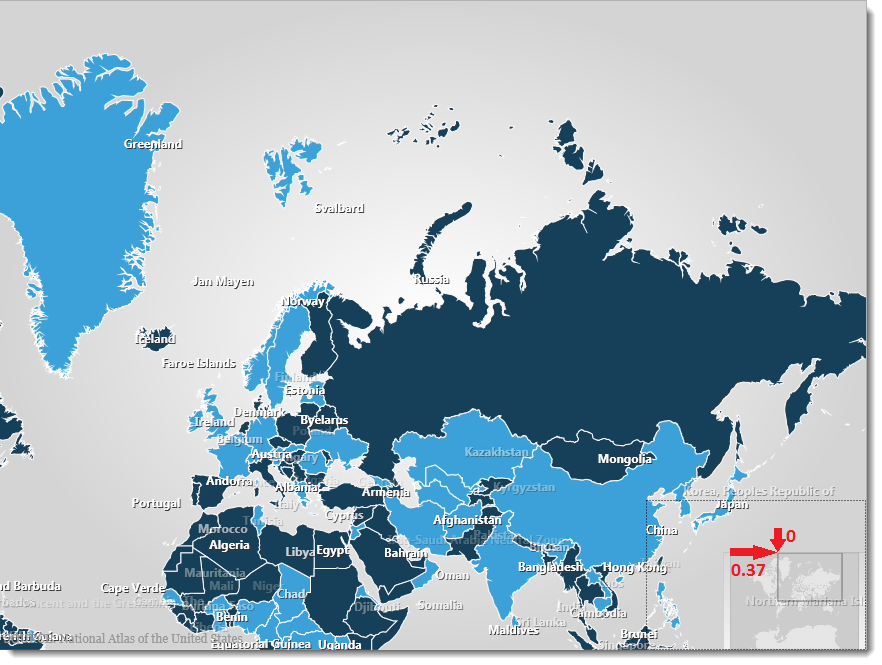
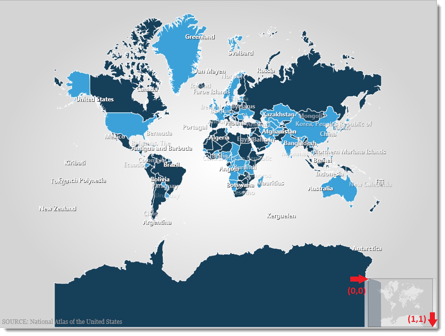
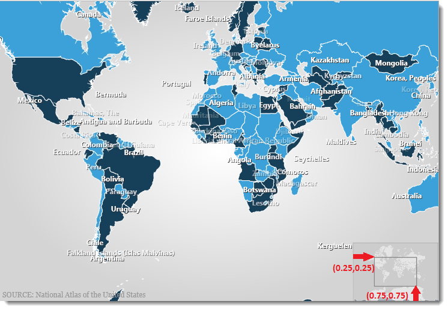

////

|metadata|
{
    "name": "panning-and-zooming",
    "controlName": [],
    "tags": [],
    "guid": "66cea700-719c-4b17-b90a-cfb3b276dec3",  
    "buildFlags": [],
    "createdOn": "2012-06-28T13:59:15.176833Z"
}
|metadata|
////

= Panning and Zooming

== Topic Overview

=== Purpose

This topic provides reference information about the methods for emulating of panning and zooming actions on Infragistics controls.

=== In this topic

This topic contains the following sections:

* <<_Ref328511628,Introduction>>
* <<_Ref328511639,Panning and Zooming Emulation Methods>>

** <<_Ref328511646, _PanArea_  >>
** <<_Ref326652875, _ZoomArea_  >>

* <<_Ref328409215,Related Content>>

[[_Ref328511628]]
== Introduction

=== Panning and zooming summary

Infragistics data visualization controls provide a feature called the Overview Plus Detail pane. This allows the user to maintain a visual perspective of the full data while panning and zooming.

Test Automation supports the emulation of panning and zooming both in the OPD and in the control itself. For this reason, the panning and zooming methods of Test Automation have some parameters whose valid range of values is based on the underlying World property of the control’s Overview Plus Detail pane.

Panning and zooming actions can be performed only on Infragistics data visualization controls:

* xamDataChart
* xamGeographicMap
* xamNetworkNode
* xamOrgChart

[[_Ref328511639]]
== Panning and Zooming Emulation Methods

=== Panning and zooming emulation methods summary chart

The following table briefly explains the methods for emulating user panning and zooming actions. Detailed information about the methods is provided in the text blocks following the table.

The accessibility of each method is specific to the control that is calling the method. Please refer to the Testable User Actions and Elements section in the documentation of the control for more details.

[options="header", cols="a,a"]
|====
|Method|Description

| _<<Ref328511646, PanArea >>_ 
|Pans the data area of the control.

| _<<Ref326652875, ZoomArea >>_ 
|Zooms the control’s view in and out.

|====

[[_Ref328511646]]
== _PanArea_

[[_Ref327944820]]

=== Description

The  _PanArea_   method pans the data area of the control.

=== Supported controls

* xamDataChart
* xamGeographicMap
* xamNetworkNode
* xamOrgChart

[[_Ref327944834]]

=== Parameters

The following table explains the method’s parameters.

[options="header", cols="a,a"]
|====
|Method parameters|Description

|dAreaLeft
|The dAreaLeft parameter specifies how far away from the left edge of the control the pan area begins. 

The parameter value is a number of type *double* , whose valid range of values varies based on the underlying World property of the control’s Overview Plus Detail pane.

|dAreaTop
|The dAreaTop specifies how far away from the top edge of the control the pan area begins. 

This is a number of type *double* , whose valid range of values varies based on the underlying World property of the control’s Overview Plus Detail pane.

|====

=== Possible exceptions

[options="header", cols="a,a,a"]
|====
|Exception name|Exception description|Possible reasons

|No explict ename.
|Cannot perform the PanArea action.
|
* The control’s panning feature is disabled 

* The window is already at its maximum zoom value and cannot be moved around within the frames control 

* The specified value is either: 

** Outside the scale (World property) of the OverviewPlusDetail, or 

** Out of bounds to a location, which would move the entire window outside the bounds of the OverviewPlusDetail’s visible area when such a move is not allowed 

|====

=== Example

Panning to a position where the upper left edge of the display is located 37% to the right of the origin and the top is aligned with the original top.

This example assumes that the Overview Plus Detail scale has a dimensional range of 0 to 1; therefore, the values of dAreaLeft, dAreaTop, dAreaRight, and dAreaBottom also share the range from 0 to 1.

WpfWindow("MainWindow").xamGeographicMap("map").PanArea 0.37, 0

[[_Ref326652875]]
== _ZoomArea_

[[_Ref327944903]]

=== Description

The  _ZoomArea_   method zooms the control’s view in and out.

=== Supported controls

* xamDataChart
* xamGeographicMap
* xamNetworkNode
* xamOrgChart

[[_Ref327944908]]

=== Parameters

The following table explains the method’s parameters.

[options="header", cols="a,a"]
|====
|Method Parameter|Description

|dAreaLeft
|This is a number of type *double* , whose valid range of values varies based on the underlying World property of the control’s Overview Plus Detail pane. 

This parameter determines how far away from the left edge of the control the zoom area begins.

|dAreaTop
|This is a number of type *double* , whose valid range of values varies based on the underlying World property of the control’s Overview Plus Detail pane. 

This parameter determines how far away from the top edge of the control the zoom area begins.

|dAreaRight
|This is a number of type *double* , whose valid range of values varies based on the underlying World property of the control’s Overview Plus Detail pane. 

This parameter determines how far away from the right edge of the control the zoom area begins.

|dAreaBottom
|This is a number of type *double* , whose valid range of values varies based on the underlying World property of the control’s Overview Plus Detail pane). 

This parameter determines how far away from the bottom edge of the control the zoom area begins.

|====

=== Possible exceptions

[options="header", cols="a,a,a"]
|====
|Exception name|Exception description|Possible reasons

|No explict ename.
|Cannot perform the ZoomAreaAction.
|
* dAreaLeft, dAreaTop, dAreaRight, and dAreaBottom may be invalid 

* The specified value is outside the scale (World property) of the OverviewPlusDetail pane 

* The entire window is moved outside the bounds of the Overview Plus Detail’s visible area when such a move is not allowed. 

|====

=== Examples

The following examples assume that the Overview Plus Detail scale has a dimensional range of 0 to 1; therefore, the values of dAreaLeft, dAreaTop, dAreaRight, and dAreaBottom also share the range from 0 to 1. *Example 1* 

Resetting the zoom of the  _xamGeographicMap_   to normal by passing values 0,0,1,1:

WpfWindow("MainWindow").xamGeographicMap("map").ZoomArea 0, 0, 1, 1 *Example 2* 

Zooming into the  _xamGeographicMap_   by 25% on all sides.

The parameter values passed in 0.25,0.25,0.75,0.75 delineate a rectangle with the top-left corner 25% from the right and 25% from the top, and with the bottom-right corner located 75% from the right and 75% from the top.

WpfWindow("MainWindow").xamGeographicMap("map").ZoomArea 0.25, 0.25, 0.75, 0.75

[[_Ref328409215]]
== Related Content

=== Topics

The following topics provide additional information related to this topic.

[options="header", cols="a,a"]
|====
|Topic|Purpose

| link:accessing-controls-properties.html[Accessing Controls' Properties]
|This topic provides reference information about the methods for accessing the properties and sub-properties of Infragistics controls.

| link:emulating-the-mouse.html[Emulating the Mouse]
|This topic provides reference information about the methods for mouse action emulation on Infragistics controls.

| link:setting-focus.html[Setting the Focus of the Application]
|This topic provides reference information about the methods for setting the application’s focus directly on a control (without emulating any mouse or key actions).

|====