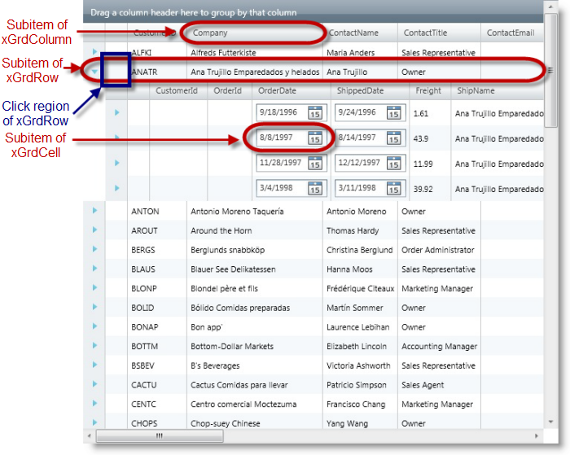
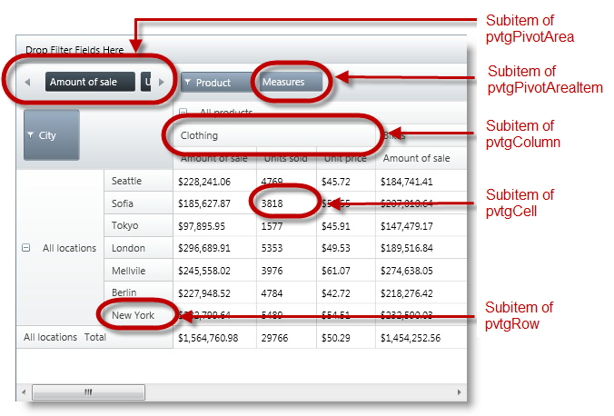
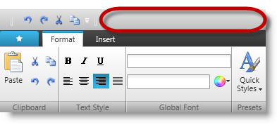
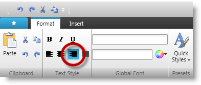
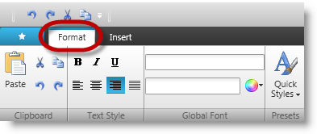

////
|metadata|
{
    "name": "subitems-recording",
    "controlName": [],
    "tags": [],
    "guid": "92f36e62-382e-45d9-8932-0e81fda21295",
    "buildFlags": [],
    "createdOn": "2012-11-03T22:30:54.2933925Z"
}
|metadata|
////

= Subitems Recording

== Topic Overview

=== Purpose

This topic provides reference information about the methods that get recorded for various sub items of the supported Infragistics controls.

=== In this topic

This topic contains the following sections:

* <<_Ref339727086, Supported Controls and Subitems >>

** <<_Ref338010188,xamDataGrid>>
** <<_Ref338010197,xamDataTree>>
** <<_Ref338010200,xamDockManager>>
** <<_Ref338010205,xamDiagramToolbox>>
** <<_Ref338010214,xamGrid>>
** <<_Ref338010222,xamMenu>>
** <<_Ref338010244,xamContextMenu>>
** <<_Ref338010250,xamNetworkNode>>
** <<_Ref338010255,xamOutlookBar>>
** <<_Ref338010260,xamPivotDataSelector>>
** <<_Ref338010263,xamPivotGrid>>
** <<_Ref338010268,xamPropertyGrid>>
** <<_Ref338010272,xamRibbon>>
** <<_Ref338010273,xamSpreadsheet>>
** <<_Ref338010275,xamTabControl>>
** <<_Ref338010281,xamTreemap>>

* <<_Ref337132254, Supported Methods >>
* <<_Ref337132262, Usage >>

** <<_Ref338113963,Enabling RecordBaseClick action>>
** <<_Ref338113976,RecordBaseClick action>>

* <<_Ref337132271, Limitations >>
* <<_Ref337132287, Examples and Previews >>

** <<_Ref337117108,Example with xamGrid>>
** <<_Ref337117122,Example with xamPivotGrid>>
** <<_Ref337131849,Example with xamRibbon>>
** <<_Ref337131861,Example with xamRibbon (RibbonTool)>>
** <<_Ref337131870,Example with xamRibbon (RibbonTabItem)>>

* <<_Ref337132389, Related Content >>

[[_Ref339727086]]
== Supported Controls and Subitems

[[_Ref338010188]]

=== xamDataGrid

The following table lists the different types of sub items in  _xamDataGrid_   control.

[options="header", cols="a,a"]
|====
|SubItem type|Argument Format

|gridField
|`gridField, "{FILTER}[id0]", igAt, 65, 11` 

Specifies the field identifier and coordinates of the location.

|gridRecord
|`gridRecord, 0, igAt, 21, 12` 

Specifies the position on the row (zero-based index), and coordinates of the location.

|gridCell
|`gridCell, "{0}[id0]", igAt, 73, 14` 

Specifies the position on the row (zero-based index) with column name, and coordinates of the location.

|====

[[_Ref338010197]]

=== xamDataTree

The following table lists the different types of sub items in  _xamDataTree_   control.

[options="header", cols="a,a"]
|====
|SubItem type|Argument Format

|treeNode
|`treeNode, ARRAY("Beverages"), igAt, 56, 14` 

Array with one Node, or more if a tree is hierarchical and coordinates of the location.

|====

[[_Ref338010200]]

=== xamDockManager

The following table lists the different types of sub items in  _xamDockManager_   control.

[options="header", cols="a,a"]
|====
|SubItem type|Argument Format

|dockPaneContent
|`dockPaneContent, ARRAY("Docked", "Left", 0, "Pane1"), igAt, 54, 9` 

Specifies the content area of a Pane of _xamDockManager_ using an array with content state, positions and identifier, and location coordinates.

|dockPaneTab
|`dockPaneTab, ARRAY("Docked", "", 0, "Document 1"), igAt, 54, 9` 

Specifies the tab identifier as "Docked", the name of the tab content, and location coordinates.

|dockPaneHeader
|`dockPaneHeader, ARRAY("Docked", "Left", 0, "Pane1"), igAt, 238, 11` 

Specifies the state of the panel ("Docked" or "Unpinned"), position ("Left" or "Right"), panel identifier, and coordinates of the location.

|====

[[_Ref338010205]]

=== xamDiagramToolbox

The following table lists the different types of sub items in  _xamDiagramToolbox_   control.

[options="header", cols="a,a"]
|====
|SubItem type|Argument Format

|dtbCategory
|`dtbCategory, "Basic Shapes", igAt, 65, 11` 

`dtbCategory, 1, igAt, 2, 2` 

Identification of the category subitem is either by string text name 

Or by the integer index

|dtbItem
|`dtbItem, ARRAY("Basic Shapes", "Circle"), igAt, 21, 12` 

`dtbItem, ARRAY("Basic Shapes", 2), igAt, 21, 12` 

`dtbItem, ARRAY(0, 2), igAt, 21, 12` 

`dtbItem, ARRAY(0, "Circle"), igAt, 21, 12` 

`dtbItem, 0, igAt, 21, 12` 

Identification of the Item subitem is either by a two dimensional array of category name or index, and item name or index of the item inside the category 

Or by the integer index of the item overall

|====

[[_Ref338010214]]

=== xamGrid

The following table lists the different types of sub items in  _xamGrid_   control.

[options="header", cols="a,a"]
|====
|SubItem type|Argument Format

|xGrdCell
|`xGrdCell, "{1}[CustomerID]", igAt, 26, 9` 

Specifies the position of the grid cell (zero-based index) using the row index with column name, and coordinates of the location.

|xGrdColumn
|`xGrdColumn, "[CustomerID]", igAt, 43, 13` 

Specifies the column name and the coordinates of the location.

|xGrdRow
|`xGrdRow, 0, igAt, 9, 14` 

Specifies the position on the row (zero-based index), and coordinates of the location.

|====

[[_Ref338010222]]

=== xamMenu xamContextMenu

The following table lists the different types of sub items in X _amMenu_   and  _XamContextMenu_   controls.

[options="header", cols="a,a"]
|====
|SubItem type|Argument Format

|mnuItem
|`mnuItem, "Create", igAt, 28, 26` 

Specifies the Item identifier and the coordinates of the location.

|====

[[_Ref338010250]]

=== xamNetworkNode

The following table lists the different types of sub items in  _xamNetworkNode_   control.

[options="header", cols="a,a"]
|====
|SubItem type|Argument Format

|nwkNode
|`nwkNode, "Node45", igAt, 32, 11` 

Specifies the active node name (when clicked), and coordinates of the location.

|====

[[_Ref338010255]]

=== xamOutlookBar

The following table lists the different types of sub items in  _xamOutlookBar_   control.

[options="header", cols="a,a"]
|====
|SubItem type|Argument Format

|obarGroup
|`obarGroup, "Group 1", igAt, 112, 11` 

Specifies the group identifier and the coordinates of the location.

|obarGroupContent
|`obarGroupContent, "", igAt, 18, 58` 

Specifies the group content using the coordinates of the location.

|obarGroupHeader
|`obarGroupHeader, "", igAt, 81, 13` 

Specifies the group header using the coordinates of the location.

|obarNavArea
|`obarNavArea, "", igAt, 2, 3` 

Represents the Navigation area of _XamOutlookBar_ .

|obarOverflowArea
|`obarOverflowArea, "", igAt, 21, 17` 

Specifies the overflow area (at the bottom) of the _XamOutlookBar_ using the coordinates of the location.

|====

[[_Ref338010260]]

=== xamPivotDataSelector

The following table lists the different types of sub items in  _xamPivotDataSelector_   control.

[options="header", cols="a,a"]
|====
|SubItem type|Argument Format

|pvtArea
|`pvtArea, "Rows", igAt, 117, 57` 

Specifies the pivot area identifier and coordinates of the location.

|pvtAreaItem
|`pvtAreaItem, ARRAY("Rows", "Product Categories"), igAt, 108, 13` 

Specifies the pivot area item identifier using an array with Item and item group, and coordinates of the location.

|====

[[_Ref338010263]]

=== xamPivotGrid

The following table lists the different types of sub items in  _xamPivotGrid_   control.

[options="header", cols="a,a"]
|====
|SubItem type|Argument Format

|pvtgRow
|`pvtgRow, 1, igAt, 44, 11` 

Specifies the position on the row (zero-based index), and coordinates of the location.

|pvtgColumn
|`pvtgColumn, 0, igAt, 116, 10` 

Specifies the position on the column (zero-based index), and coordinates of the location.

|pvtgCell
|`pvtgCell, ARRAY(iDataRowIndex, iDataColumnIndex)` 

Specifies array coordinates as zero-based index (Row, Column) of the cell e.g. ARRAY(0,2)

|pvtgPivotArea
|`pvtgPivotArea, "Rows", igAt, 117, 57` 

Allows fixed set of values: 

* "Rows" 

* "Columns" 

* "Filters" 

* "Measures"

|pvtgPivotAreaItem
|`pvtgPivotAreaItem, ARRAY("Rows", "Product Categories"), igAt, 108, 13` 

Specifies the pivot area item using an array and location coordinates.

|====

[[_Ref338010268]]

=== xamPropertyGrid

The following table lists the different types of sub items in  _xamPropertyGrid_   control.

[options="header", cols="a,a"]
|====
|SubItem type|Argument Format

|prpgFilterArea
|`prpgFilterArea, "", igAt, 65, 11` 

Identification of the Filter area subitem is ignored, as there is only one. But the parameter cannot be empty.

|prpgProperty
|`prpgProperty, "FontWeight", igAt, 21, 12` 

Identification of the Property subitem is only by the string text DisplayName

|prpgCategory
|`prpgCategory, "Basic Shapes", igAt, 65, 11` 

Identification of the Category subitem is only by the string text DisplayName

|prpgDescription
|`prpgDescription, "" igAt, 21, 12` 

Identification of the Description area subitem is ignored, as there is only one. But the parameter cannot be empty.

|====

[[_Ref338010272]]

=== xamRibbon

The following table lists the different types of sub items in  _xamRibbon_   control with an example from a recorded script.

[options="header", cols="a,a"]
|====
|SubItem type|Argument Format

|rbnAppMenuFooter
|`rbnAppMenuFooter, "", igAt, 25, 13` 

Represents the Application Menu Footer Toolbar of _XamRibbon_ .

|rbnAppMenuLeft
|`rbnAppMenuLeft, "", igAt, 25, 13` 

Represents the Application Menu Left Area of _XamRibbon_ .

|rbnAppMenuRecent
|`rbnAppMenuRecent, "", igAt, 25, 13` 

Specifies the recent item with coordinates of the location.

|rbnGroup
|`rbnGroup, ARRAY("RibbonGroup", "Ribbon Tab", 0, 0, 0, "Aqua"), igAt, 57, 13` 

Specifies the ribbon group identifier using an array that contains the group name, tab name and tool name, and coordinates of the location.

|rbnQAT
|`rbnQAT, "", igAt, 25, 13` 

Specifies the coordinates of the location of the Quick Access toolbar

|rbnQuickCustMenu
|`rbnQuickCustomMenu, "QAT Item", igAt, 20, 30` 

Specifies the "Quick Customize Menu" identifier and coordinates of the location of an item in the "Quick Customize Menu"

|rbnTabItem
|`rbnTabItem, "Ribbon Tab", igAt, 36, 12` 

Tab item name or index and coordinates of the location.

|rbnTool
|`rbnTool, ARRAY("RibbonGroup", "Ribbon Tab", 0, 0, 0, "Aqua"), igAt, 57, 13` 

Specifies the ribbon tool identifier using an array that contains the group name, tab name and tool name, and coordinates of the location.

|====

[[_Ref338010273]]

=== xamSpreadsheet

The following table lists the different types of sub items in  _xamSpreadsheet_   control with an example from a recorded script.

[options="header", cols="a,a"]
|====
|SubItem type|Argument Format

|sshtCell
|`sshtCell, "A1", igAt, 65, 11` 

Identification of the cell subitem is by string combination of ColumnName and Row number

|sshtColumn
|`sshtColumn, "D", igAt, 21, 12` 

`sshtColumn, 0, igAt, 21, 12` 

Identification of the Column subitem is string column name 

Or by the zero based integer index of the column

|sshtRow
|`sshtRow, "D", igAt, 21, 12` 

Identification of the Row subitem is number corresponding to the row

|sshtSheet
|`sshtSheet, "Sheet1", igAt, 21, 12` 

`sshtSheet, 0, igAt, 21, 12` 

Identification of the Column Sheet is string Sheet name 

Or by the zero based integer index

|sshtFormulaBarNameBox
|`sshtFormulaBarNameBox, null, igAt, 21, 12` 

Identification of the FormulaBarNameBox subitem is ignored, as there is only one. But the parameter cannot be empty.

|sshtFormulaBarTextEditor
|`sshtFormulaBarTextEditor, null, igAt, 21, 12` 

Identification of the FormulaBarTextEditor subitem is ignored, as there is only one. But the parameter cannot be empty.

|====

[[_Ref338010275]]

=== xamTabControl

The following table lists the different types of sub items in  _xamTabControl_   control.

[options="header", cols="a,a"]
|====
|SubItem type|Argument Format

|tabHeader
|`tabHeader, "Tab1", igAt, 23, 12` 

Specifies tab header identifier, and coordination of the location.

|tabContent
|`tabContent, "", igAt, 47, 119` 

Specifies the (X, Y) coordinates of the tab content.

|tabCloseButton
|`tabCloseButton, "Tab7", igAt, 3, 6` 

Specifies the tab header identifier, and coordinates of the close button located on the tab itself. 

`tabCloseButton, "", igAt, 3, 6` 

This is another close button located outside of the tab area, which functions to close any active tab when clicked.

|====

[[_Ref338010281]]

=== xamTreemap

The following table lists the different types of sub items in X _amTreemap_   control.

[options="header", cols="a,a"]
|====
|SubItem type|Argument Format

|tmapNode
|`tmapNode, Array(0, "NJ"), igAt, 5,5` 

Represents a node of _XamTreemap_ .

|====

[[_Ref337132254]]
== Supported Methods

=== Click action methods

Below is a list of methods that support recording of subitems with a click action:

* link:{ApiPlatform}test.shared~infragisticswpf.test.shared.recordreplayproxybase~clicksubitem.html[ClickSubItem]
* link:{ApiPlatform}test.shared~infragisticswpf.test.shared.recordreplayproxybase~dblclicksubitem.html[DblClickSubItem]
* link:{ApiPlatform}test.shared~infragisticswpf.test.shared.recordreplayproxybase~rightclicksubitem.html[RightClickSubItem]
* link:{ApiPlatform}test.shared~infragisticswpf.test.shared.recordreplayproxybase~clickcontrol.html[ClickControl]
* link:{ApiPlatform}test.shared~infragisticswpf.test.shared.recordreplayproxybase~dblclickcontrol.html[DblClickControl]
* link:{ApiPlatform}test.shared~infragisticswpf.test.shared.recordreplayproxybase~rightclickcontrol.html[RightClickControl]

.Note:
[NOTE]
====
PanArea and ZoomArea methods are also supported during record subitem for controls:  _xamNetworkNode_  ,  _xamOrgChart_  ,  _xamDataChart_  ,  _xamGeographicMap_
====

[[_Ref337132262]]
== Usage

[[_Ref338113963]]

=== Enabling RecordBaseClick action

Enable the  _RecordBaseClick_   option of the control proxy

Enable the control proxy  _RecordBaseClick_   option using the Test Automation Settings Utility and navigating by means of Windows start menu.

1. Locate and drill down into the …\infragistics\{ProductVersion}\WPF Test Automation for Micro Focus… folder as illustrated in the following images.

The following screenshot illustrates the Infragistics folder hierarchy and the relative location of the toolset.

*image::images/Subitems_Recording_1.png[]*

2. The next screenshot shows the location of settings Reset and RootOverride to enable the RecordBaseClick option. This particular screenshot depicts enabling the RecordBaseClick option on the XamPivotGridProxy’s settings, as indicated by the presence of the checkmark in its corresponding value column.

*image::images/Subitems_Recording_2.png[]*

[[_Ref337539845]]

=== RecordBaseClick action

_RecordBaseClick_   is a member of `IGProxySetting` enumeration which handles every click action on the control. Default value is set to false.

* Turning on the `RecordBaseClick` feature allows you to record only the supported methods. None of the control’s other methods are recorded

* The  _RightClickSubItem_   or  _RightClickControl_   methods allow recording even if the `RecordBaseClick` feature is turned off

* When clicking subitems with the left mouse button:

`igAt` –used to record the X and Y coordinates of the region

`igPercent` –used to record the coordinates as percentages.

The following recorded script displays the array coordinates (1, 0) as (Row, Column) respectively, and the corresponding click coordinates, for example, when clicked at the center with percentage used with `igPercent`.

[source,csharp]
----
XamPivotGrid("xamPivotGrid1").ClickSubItem pvtgCell, ARRAY(1, 0), igPercent, 0.5, 0.5
----

.Note:
[NOTE]
====
To enable the `igPercent` option, you need to follow the same steps as described in <<_Ref337132262,Usage>>, and use the check box for  _RecordClickPercent_   in the second step.
====

* When clicking the mouse’s left button on:

** a control’s SubItem, records the SubItem methods such as  _ClickSubItem, DblClickSubItem_   or  _RightClickSubItem_  
** The control itself, records the control methods such as:  _ClickControl_  ,  _DblClickControl_   or  _RightClickControl_   if sub item is not found for the control at the point of click.

[[_Ref337132271]]
== Limitations

=== Feature limitations

.Note:
[NOTE]
====
You can only use the Settings Utility to toggle the RecordBaseClick feature On or Off in between QuickTest Professional Product (QTP) recording sessions. In other words, you will need to restart the QTP session for the changes to take effect.
====

* Limitations of the Settings Utility also apply to all the Record control settings including the  _RecordBaseClick_  ,  _RecordItemsByIndex_  ,  _RecordClickPercent_   and  _RecordForceFireEvents_  options.

* Using the Settings Utility to modify any of the control settings, during the recording session, requires the user to stop and restart the recording for the modified control setting to apply.

* Recording of  _ClickSubItem_   and  _DblClickSubItem_   is disabled in the following areas:

Content areas of the XamTabControl, XamDockManager and XamOutlookBar.

Filter dialogs of the XamPivotGrid and XamPivotDataSelector.

[[_Ref337132287]]
== Examples and Previews

=== Examples summary

The following table lists the code examples included in this topic.

[options="header", cols="a,a"]
|====
|Example|Description

|<<_Ref337117108,xamGrid>>
|Illustrates the recording action with _xamGrid_ control including the preview and the recorded script.

|<<_Ref337117122,xamPivotGrid>>
|Illustrates the recording action with _xamPivotGrid_ control including the preview and the recorded script.

|<<_Ref337131849,xamRibbon>>
|Illustrates the recording action with _xamRibbon_ control including the preview and the recorded script.

|<<_Ref337131861,xamRibbon (RibbonTool)>>
|Illustrates the recording action with _RibbonTool_ of _xamRibbon_ control including the preview and the recorded script.

|<<_Ref337131870,xamRibbon (RibbonTabItem)>>
|Illustrates the recording action with _RibbonTabItem_ of _xamRibbon_ control including the preview and the recorded script.

|====

[[_Ref337117108]]
== Example with xamGrid

[[_Ref337049378]]

=== Preview

The following table lists the different types of subitems in  _xamGrid_   control when recording  _ClickSubItem_  ,  _DblClickSubItem_   and  _RightClickSubItem_   actions, and annotated in the image following the table.

[options="header", cols="a,a"]
|====
|SubItem type|Description

|`xGrdColumn`
|xamGrid header cell control.

|`xGrdRow`
|xamGrid row cell panel control.

|`xGrdCell`
|xamGrid cell control.

|====

.Note:
[NOTE]
====
The  _xGrdRow_   SubItem is treated slightly differently than the other subitems. Due to the fact that the row consists of cells, clicking on a row will record the action as  _xGrdCell_   rather than  _xGrdRow_  . The xamGridRow gets recorded in all scenarios when the click is not directly on the cell within that row, such as the row selector or the row expansion indicator.
====

=== Single-click action

Clicking any of the subitems (Outlined in the preview) with left mouse button, records the ClickSubItem action as follows:

[source,csharp]
----
XamGrid("myGrid").ClickSubItem xGrdColumn, "[Company]", igAt, 62, 7  
XamGrid("myGrid").ClickSubItem xGrdRow, 1, igAt, 37, 12  
XamGrid("myGrid").ClickSubItem xGrdCell, "{1}{1}[OrderDate]", igAt, 42, 10
----

In the above recorded script:

* The first parameter (`xGrdColumn`) is the subItemType
* The second parameter (`[Company]`) identifies the clicked sub-item
* The third parameter (`igAt`) represents the X and Y coordinates of the mouse click action relative to SubItem.

=== Double-click action

Performing a double-click action instead of a single-click on the SubItem (Outlined in the preview), records the following action:

[source,csharp]
----
XamGrid("myGrid").DblClickSubItem xGrdColumn, "[Company]", igAt, 62, 7  
XamGrid("myGrid").DblClickSubItem xGrdRow, 1, igAt, 37, 12  
XamGrid("myGrid").DblClickSubItem xGrdCell, "{1}{1}[OrderDate]", igAt, 42, 10
----

=== Right-click action

Performing a right-click action on the SubItem (Outlined in the preview), records the following action:

[source,csharp]
----
XamGrid("myGrid").RightClickSubItem xGrdColumn, "[Company]", igAt, 62, 7  
XamGrid("myGrid").RightClickSubItem xGrdRow, 1, igAt, 37, 12  
XamGrid("myGrid").RightClickSubItem xGrdCell, "{1}{1}[OrderDate]", igAt, 42, 10
----

[[_Ref337117122]]
== Example with xamPivotGrid

[[_Ref337049398]]

=== Preview

The following table lists the different types of subitems in  _xamPivotGrid_   control when recording  _ClickSubItem_  ,  _DblClickSubItem_   and  _RightClickSubItem_   actions, and annotated in the image following the table.

[options="header", cols="a,a"]
|====
|SubItem type|Description

|`pvtgPivotArea`
|xamPivotGrid area control.

|`pvtgPivotAreaItem`
|xamPivotGrid item control within an area.

|`pvtgColumn`
|xamPivotGrid column header cell control.

|`pvtgCell`
|xamPivotGrid cell control.

|`pvtgRow`
|xamPivotGrid row header cell control.

|====

=== Single-click action

Performing  _single-click_   action by clicking on any of the subitems (Outlined in the preview) with the left mouse button, which records the  _ClickSubItem_   as follows:

[source,csharp]
----
XamPivotGrid("myPivotGrid").ClickSubItem pvtgPivotArea, "Measures", igAt, 2,2
XamPivotGrid("myPivotGrid").ClickSubItem pvtgPivotAreaItem, ARRAY("Columns", "Measures"), igAt, 2,2
XamPivotGrid("myPivotGrid").ClickSubItem pvtgColumn, 0, igAt, 2,2
XamPivotGrid("myPivotGrid").ClickSubItem pvtgCell, ARRAY(1, 1), igAt, 2,2
XamPivotGrid("myPivotGrid").ClickSubItem pvtgRow, 6, igAt, 2,
----

=== Double-click action

Performing a  _double-click_   action on the SubItem (Outlined in the preview), which records the following action:

[source,csharp]
----
XamPivotGrid("myPivotGrid").DblClickSubItem pvtgPivotArea, "Measures", igAt, 2,2
XamPivotGrid("myPivotGrid").DblClickSubItem pvtgPivotAreaItem, ARRAY("Columns", "Measures"), igAt, 2,2
XamPivotGrid("myPivotGrid").DblClickSubItem pvtgColumn,
 0, igAt, 2,2
XamPivotGrid("myPivotGrid").DblClickSubItem pvtgCell, 
ARRAY(1, 1), igAt, 2,2
XamPivotGrid("myPivotGrid").DblClickSubItem pvtgRow,
 6, igAt, 2,2
----

=== Right-click action

Performing a  _right-click_   action on the SubItem (Outlined in the preview), which records the following action:

[source,csharp]
----
XamPivotGrid("myPivotGrid").RightClickSubItem pvtgPivotArea, "Measures", igAt, 2,2
XamPivotGrid("myPivotGrid").RightClickSubItem pvtgPivotAreaItem, ARRAY("Columns", "Measures"), igAt, 2,2
XamPivotGrid("myPivotGrid").RightClickSubItem pvtgColumn, 0, igAt, 2,2
XamPivotGrid("myPivotGrid").RightClickSubItem pvtgCell, ARRAY(1, 1), igAt, 2,2
XamPivotGrid("myPivotGrid").RightClickSubItem pvtgRow, 6, igAt, 2,2
----

[[_Ref337131849]]
== Example with xamRibbon

=== Preview

The following image illustrates the click area in  _xamRibbon_   control when recording  _ClickControl_  ,  _DblClickControl_   and  _RightClickControl_   actions.

=== Single-click action

Clicking the region(Outlined in the preview) with the left mouse button, records the ClickControl as follows:

[source,csharp]
----
XamRibbon("myRibbon").ClickControl igAt, 50,4
----

=== Double-click action

Performing a  _double-click_   action instead of a single-click on the SubItem (Outlined in the preview), which records the following action:

[source,csharp]
----
XamRibbon("myRibbon").DblClickControl igAt, 50,4
----

=== Right-click action

Performing a  _right-click_   action on the SubItem (Outlined in the preview), which records the following action:

[source,csharp]
----
XamRibbon("myRibbon").RightClickControl igAt, 50,4
----

[[_Ref337131861]]
== Example with xamRibbon (RibbonTool)

=== Preview

The following image illustrates the  _RibbonTool_   SubItem type in  _xamRibbon_   control when recording  _ClickSubItem_  ,  _DblClickSubItem_   and  _RightClickSubItem_   actions.

=== Single-click action

. Clicking the SubItem (Outlined in the preview) with the left mouse button, records the ClickSubItem as follows:

[source,csharp]
----
XamRibbon("myRibbon").ClickSubItem RibbonTool, ARRAY("RibbonGroup", "Format", "Text Style", 0, 1, 2), igAt, 1,2
----

* The `RibbonTool` is a SubItem type
* The `ARRAY` parameter is the identifier of the tool that is clicked
* The `igAt 1,2` are the X and Y coordinates of the mouse click relative to the tool.

.Note:
[NOTE]
====
If the proxy setting of  _RecordClickPercent_   is enabled (set to  _true_  ) a single click of the mouse’s left button at the center of the SubItem of the control, records `igPercent` instead of `igAt` as demonstrated in the following script.
====

[source,csharp]
----
XamRibbon("myRibbon").ClickSubItem RibbonTool, ARRAY("RibbonGroup", "Format", "Text Style", 0, 1, 2), igPercent, 0.5, 0.5
----

=== Double-click action

Performing a  _double-click_   action instead of a single-click on the SubItem (Outlined in the preview), which records the following action :

[source,csharp]
----
XamRibbon("myRibbon").DblClickSubItem RibbonTool, ARRAY("RibbonGroup", "Format", "Text Style", 0, 1, 2), igAt, 1,2
----

=== Right-click action

Performing a  _right-click_   action on the SubItem (Outlined in the preview), which records the following action:

[source,csharp]
----
XamRibbon("myRibbon").RightClickSubItem RibbonTool, ARRAY("RibbonGroup", "Format", "Text Style", 0, 1, 2), igAt, 1,2
----

[[_Ref337131870]]
== Example with xamRibbon (RibbonTabItem)

=== Preview

The following image illustrates the  _RibbonTabItem_   SubItem type in  _xamRibbon_   control when recording  _ClickSubItem_  ,  _DblClickSubItem_   and  _RightClickSubItem_   actions.

=== Script

Clicking the  _RibbonTabItem_   SubItem (Outlined in the preview) with the left mouse button, records the ClickSubItem as follows:

[source,csharp]
----
XamRibbon("myRibbon").ClickSubItem RibbonTabItem, "Format", igAt, 5,6
----

[[_Ref337132389]]
== Related Content

=== Topics

The following topics provide additional information related to this topic.

[options="header", cols="a,a"]
|====
|Topic|Purpose

| link:emulating-the-mouse.html[Emulating the Mouse]
|This topic provides reference information about the methods for mouse action emulation on Infragistics controls.

|====