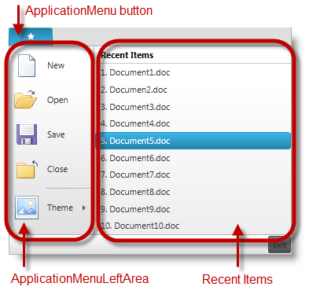
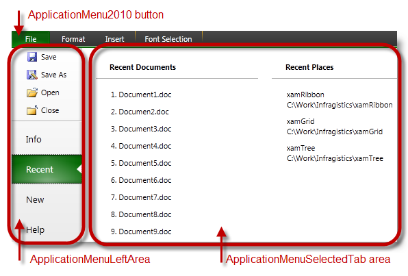

////
|metadata|
{
    "name": "whats-new-in-2013-volume-1",
    "controlName": [],
    "tags": [],
    "guid": "b1d5d0f9-e576-47aa-8add-38cb110c88ed",
    "buildFlags": [],
    "createdOn": "2013-04-03T13:31:37.178276Z"
}
|metadata|
////

= What's New in 2013 Volume 1

== What’s New Summary

=== Features Overview

The following table summarizes the new features of the  _{ProductName} 2013 Volume 1_  . Additional details are available after the following summary table.

[options="header", cols="a,a,a"]
|====
|Control|Feature|Description

| _xamDoughnutChart_ 
|<<_Ref354666588, _xamDoughnutChart_ control proxy>>
|Introduces new _xamDoughnutChart_ control proxy.

| _xamRibbon_ 
|<<_Ref354666567, _xamRibbon_ updates>>
|Introduces changes in _xamRibbon_ control’s properties and methods.

| _xamSyntaxEditor_ 
|<<_Ref354666573, _xamSyntaxEditor_ updates>>
|Introduces changes in _xamSyntaxEditor_ control’s properties and methods.

|====

[[_Ref354666522]]
== _xamDoughnutChart_

[[_Ref354666588]]

=== xamDoughnutChart control proxy

The release of 2013 volume 1 adds support to the xamDoughnutChart control. This proxy contains user recordable actions with the ability to replay, via either script or User Interface (UI), to test and inspect the control’s featured areas of the  _xamDoughnutChart_  .

==== Related Link

* link:xamdoughnutchart.html[xamDoughnutChart]

[[_Ref354666545]]
== _xamRibbon_

[[_Ref354666567]]

=== xamRibbon updates

The  _xamRibbon_   control was supported since the release of 2010 volume 3. In this release of 2013 volume 1 the  _xamRibbon_   supports  _ApplicationMenu2010_  . The recording action will still return “ApplicationMenu” similar to the Office2007  _ApplicationMenu_  . The only difference is the appearance. The left area of the  _ApplicationMenu2010_   will record as “ApplicationMenuLeftArea”, also similar to the Office2007  _ApplicationMenu_  .

Added new area type “ApplicationMenuSelectedTab”, which allows you to record on the  _ApplicationMenu2010_   items residing in the currently selected tab area.

.Note:
[NOTE]
====
_ApplicationMenu_   and  _ApplicationMenu2010_   cannot coexist in the same UI.
====

Clicking the  _ApplicationMenu_   button opens up the  _ApplicationMenuLeftArea_   and displays the recently viewed items.

Clicking the  _ApplicationMenu2010_   button opens up the ApplicationMenuLeftArea, then selecting the, “Recent” item displays its related content (on right).

==== Related Links

* link:xamribbon.html[xamRibbon]

[[_Ref354666552]]
== _xamSyntaxEditor_

[[_Ref354666573]]

=== xamSyntaxEditor updates

The release of 2013 volume 1 adds new  _ExecuteCommand_   action for the xamSyntaxEditor control. This command performs cut, copy and paste operations allowing you to record these actions via a keyboard and replay them using a script.

==== Related Links

* link:xamsyntaxeditor.html[xamSyntaxEditor]