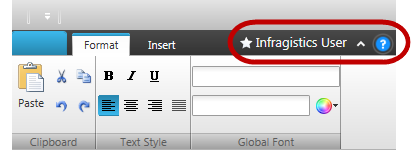

////
|metadata|
{
    "name": "whats-new-in-2014-volume-1",
    "controlName": [],
    "tags": [],
    "guid": "4279ca8d-bc50-451f-b0d0-b2b007f62172",
    "buildFlags": [],
    "createdOn": "2014-04-30T18:29:15.2792081Z"
}
|metadata|
////

= What's New in 2014 Volume 1

== What’s New Summary

=== What’s new summary chart

This topic summarizes the new and enhanced features for the 2014.1 volume release of the Infragistics® {ProductName} ( _Unified Functional Testing_  ).

==== _xamRadialMenu_,  _xamRadialMenuListBox_

[options="header", cols="a,a"]
|====
|Feature|Description

|New control
|{ProductName} supports the _xamRadialMenu_ control as part of the Ultimate UI for WPF product in the 2014.1 release. A detailed explanation of the Test Automation with this control is available in the 

== Related topics
elow. 

==== Related topics: 

* link:xamradialmenu.html[xamRadialMenu] 

* link:xamradialmenulistbox.html[xamRadialMenuListBox] 

|====

==== _xamComboEditor_

[options="header", cols="a,a"]
|====
|Feature|Description

|New properties
|This section Identifies the new properties added to the _xamComboEditor_ control proxy for WPF Test Automation 2014.1. 

==== Related topic: 

* link:xamcomboeditor-property-reference.html[xamComboEditor - Property Reference] 

|====

==== _xamDataGrid_

[options="header", cols="a,a"]
|====
|Feature|Description

|New properties and updated enumerations
|This section Identifies the new property ( _FilteredInRecordCount_ ) and an updated enumerations of the _xamDataGrid_ control proxy for WPF Test Automation 2014.1. 

==== Related topics: 

* link:xamdatapresenter-property-reference.html[xamDataPresenter - Property Reference] 

* link:xamdatapresenter-enumeration-reference.html[xamDataPresenter - Enumeration Reference] 

|====

==== _xamRibbon_

[options="header", cols="a,a"]
|====
|Feature|Description

|Tab item area
|This section Identifies two new properties ( _TabItemAreaItems_, and _TabItemAreaItemsCount_ ), and support for new tab item area of the _xamRibbon_ control proxy for WPF Test Automation 2014.1. 

It records and replays actions with the elements in the _TabItemAreaToolbar_ . 

 

==== Related topic: 

* link:xamribbon-recordable-methods.html[xamRibbon - Recordable Methods] 

* link:xamribbon-property-reference.html[xamRibbon - Property Reference] 

|====