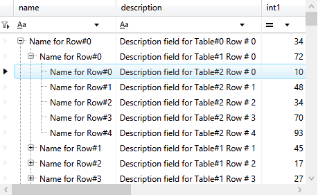
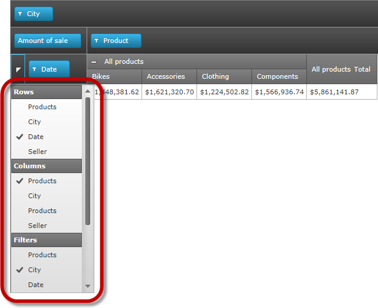

////

|metadata|
{
    "name": "whats-new-in-2015-volume-1",
    "controlName": [],
    "tags": [],
    "guid": "9cafa7a0-225b-41cd-b6ae-12e25fae403c",  
    "buildFlags": [],
    "createdOn": "2015-04-06T19:43:59.5670262Z"
}
|metadata|
////

= What's New in 2015 Volume 1

== Topic Overview

=== Purpose

This topic presents control proxies of the new and enhanced features for the Infragistics® Test Automation for WPF (Unified Functional Testing) for 2015 Volume 1 release.

== What’s New Summary

=== What’s new summary chart

The following table summarizes the new features in Infragistics 2015 Volume 1 controls suite that are now supported in Infragistics Test Automation.

==== xamSpreadsheet

[options="header", cols="a,a"]
|====
|Feature|Description

|Additional Formatting options
|The xamSpreadSheet offers several additional means of formatting text, including Superscript, Subscript, Underline, DoubleUnderline, and Hyperlink support. 

==== Related topic: 

link:xamspreadsheet.html[xamSpreadsheet]

|====

==== xamTreeGrid

[options="header", cols="a,a"]
|====
|Feature|Description

|New Control
|The xamTreeGrid is a new custom stylized version of the xamDataPresenter family of controls, similar to the xamDataGrid. Intended to display hierarchical data that has the same foot print. 

 

==== Related topic: 

link:xamdatapresenter.html[xamDataPresenter]

|====

==== xamDataGrid

[options="header", cols="a,a"]
|====
|Feature|Description

|Excel Style Filtering
|The xamDataGrid contains Excel Style Filtering. This filter allows more user friendly filtering in xamDataGrid control. 

image::images/What's_New_in_2015_Volume_1(TA-WPF)_2.png[] 

*Related Topic:*

link:xamdatapresenter.html[xamDataPresenter]

|====

==== xamPivotGrid

[options="header", cols="a,a"]
|====
|Feature|Description

|FieldChooserDropDown
|The xamPivotGrid control includes the Field Chooser control, which can be used by users to quickly select hierarchies to add to the rows, columns, filters and measures. 

|====