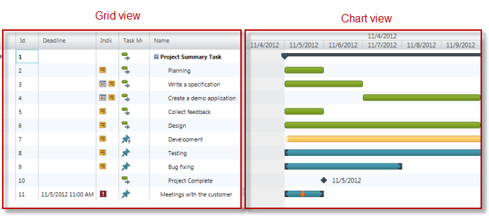

////

|metadata|
{
    "name": "xamgantt-testable-user-actions-and-elements",
    "controlName": [],
    "tags": [],
    "guid": "19d78871-ef98-4e34-b715-d183e7ec12fb",  
    "buildFlags": [],
    "createdOn": "2012-10-29T20:43:18.292123Z"
}
|metadata|
////

= xamGantt - Testable User Actions and Elements

== Topic Overview

=== Purpose

This topic provides information about the  _xamGantt_™ control’s testable user actions and elements.

=== In this topic

This topic contains the following sections:

* <<_Ref339896174,Preview>>
* <<_Ref338260068, _xamGantt_   Testable User Actions>>
* <<_Ref338260076, _xamGantt_   Testable Elements>>
* <<_Ref337132389,Related Content>>

[[_Ref339896174]]
== Preview

=== xamGantt views

The  _xamGantt_   control displays the project tasks in two views (Grid and Chart).

[[_Ref338260068]]
== _xamGantt_   Testable User Actions

=== Testable user action chart

The following table summarizes the control’s user actions, and maps to the recordable methods that emulate them.

==== _xamGantt_   user actions.

[options="header", cols="a,a,a"]
|====
|Action view groups|User action|Method

|Chart view
|Moving the supplied task to a new start date.
| link:xamgantt-recordable-methods.html#_Ref339036148[MoveTask]

|
|Resizing the supplied task to a new end date.
| link:xamgantt-recordable-methods.html#_Ref339036158[ResizeTask]

|
|Setting the supplied task’s percent complete.
| link:xamgantt-recordable-methods.html#_Ref339036172[SetTaskPercent]

|
|Setting the supplied task’s date as a deadline.
| link:xamgantt-recordable-methods.html#_Ref339036182[SetTaskDeadline]

|Grid view
|Collapsing the specified cell’s task.
| link:xamgantt-recordable-methods.html#_Ref339036139[CollapseTaskCell]

|
|Expanding the specified cell’s task.
| link:xamgantt-recordable-methods.html#_Ref338271984[ExpandTaskCell]

|Miscellaneous view
|Deleting the selected tasks.
| link:xamgantt-recordable-methods.html#_Ref339036217[DeleteSelectedTasks]

|
|Splitting the view of a _xamGantt_ between Grid and Timeline, or setting the location of the splitter, or both.
| link:xamgantt-recordable-methods.html#_Ref339036194[SetSplitter]

|
|Setting the property value of the supplied task.
| link:xamgantt-replay-only-methods.html#_Ref338271990[SetTaskProperty]

|Setting the first visible date to a task where the first date increment includes the supplied date.
| link:xamgantt-replay-only-methods.html#_Ref339036207[SetFirstVisibleDate]

|====

==== _xamGantt_   user actions inherited from  _xamGrid_  .

[options="header", cols="a,a,a"]
|====
|User action type|User action|Method

|Navigating and Selecting
|Activating a _xamGantt_ cell.
| link:xamgrid-navigating-and-selecting.html#_ActivateCell[ActivateCell]

|
|Selecting a _xamGantt_ selectable item (cell, column or row).
| link:xamgrid-navigating-and-selecting.html#_Select[Select]

|
|Adding a _xamGantt_ selectable item into a selection.
| link:xamgrid-navigating-and-selecting.html#_SelectionAdded[SelectionAdded]

|
|Changing existing _xamGantt_ selectable item selection.
| link:xamgrid-navigating-and-selecting.html#_SelectionChanged[SelectionChanged]

|
|Removing items from an existing selection.
| link:xamgrid-navigating-and-selecting.html#_SelectionRemoved[SelectionRemoved]

|
|Clearing the task selection made by the user.
| link:{ApiPlatform}test.controls.grids.xamgrid~infragisticswpf.test.controls.grids.xamgridproxybase~clearselection.html[ClearSelection]

|Editing
|Copying the selected cell(s) to the clipboard.
| link:xamgrid-editing.html#_CopyToClipboard[CopyToClipboard]

|
|Pasting cell(s) value from the clipboard into the _xamGantt_ .
| link:xamgrid-editing.html#_PasteFromClipboard[PasteFromClipboard]

|
|Allows entering edit mode in the selected cell.
| link:xamgrid-replayonly-methods.html#_CellEnterEditMode[CellEnterEditMode]

|
|Setting a new value in a _xamGantt_ cell.
| link:xamgrid-editing.html#_SetCellData[SetCellData]

|
|Exiting of the row or cell edit mode.
| link:xamgrid-editing.html#_ExitEditMode[ExitEditMode]

|Display
|Hiding the supplied column.
| link:xamgrid-display.html#_HideColumn[HideColumn]

|
|Moving the supplied column to the specified index relative to its parent.
| link:xamgrid-display.html#_MoveColumn[MoveColumn]

|
|Displaying the column from hidden state.
| link:{ApiPlatform}test.controls.grids.xamgrid~infragisticswpf.test.controls.grids.xamgridproxybase~showcolumn.html[ShowColumn]

|
|Resizing the supplied column or array of columns to a specific size. If you do not specify a size, the column will take the _autosize_ mode by default.
| link:xamgrid-display.html#_ResizeColumn[ResizeColumn]

|Sorting and Grouping
|Setting a column to a _Sorting_ mode.
| link:xamgrid-sorting-and-grouping.html#_SortColumn[SortColumn]

|====

[[_Ref338260076]]
== _xamGantt_   Testable Elements

=== Testable elements summary chart

The following table lists the elements in the Grid side of the  _xamGantt_   control that you can test and retrieve information about them along with the properties and methods managing the retrieval operations.
include::shared-legend.adoc[]

[options="header", cols="a,a,a,a,a"]
|====
|Tested elements|Test deliverable|Member type|Test object member|Accessibility

|Cell
|The active cell path.
|Property
|ActiveCell
|image:images/spy.png[] 
image:images/checkpoint.png[]

|Cell
|The value of the cell.
|Method
|GetCellData
|image:images/script.png[]

|Data
|All cell data in the cross-section of visible rows and columns in the active area.
|Verifiable table content
|
|image:images/checkpoint.png[]

|Columns
|String identifier for all column of the ActiveArea, including hidden columns.
|Property
|AllColumns
|image:images/spy.png[] 
image:images/checkpoint.png[] 
image:images/script.png[]

|Columns
|Integer value representing the ActiveArea’s count of all Columns, including hidden columns.
|Property
|AllColumnCount
|image:images/spy.png[] 
image:images/checkpoint.png[] 
image:images/script.png[]

|Column
|The delimited list of the visible columns’ identifiers in the active area.
|Property
|Columns
|image:images/spy.png[] 
image:images/checkpoint.png[] 
image:images/script.png[]

|Column
|The number of visible columns in the active area.
|Property
|ColumnCount
|image:images/spy.png[] 
image:images/checkpoint.png[] 
image:images/script.png[]

|Row
|The number of visible rows in the active area.
|Property
|RowCount
|image:images/spy.png[] 
image:images/checkpoint.png[] 
image:images/script.png[]

|Row
|The active row path.
|Property
|ActiveRow
|image:images/spy.png[] 
image:images/checkpoint.png[]

|Task
|Returning the property value of the supplied task.
|Method
|GetTaskProperty
|image:images/script.png[]

|====

[[_Ref337132389]]
== Related Content

=== Topics

The following topics provide additional information related to this topic.

[options="header", cols="a,a"]
|====
|Topic|Purpose

| link:xamgantt-recordable-methods.html[xamGantt - Recordable Methods]
|This topic provides information about the _xamGantt_ control’s testable user recordable methods.

| link:xamgantt-replay-only-methods.html[xamGantt - Replay-Only Methods]
|This topic provides information about the _xamGantt_ control’s testable user replay-only methods.

|====