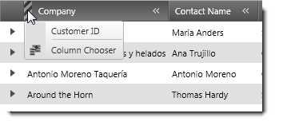

////
|metadata|
{
    "name": "xamgrid-display",
    "controlName": [],
    "tags": [],
    "guid": "6e6caf24-0d6e-4dcd-b84e-7a2a64f44dc1",
    "buildFlags": [],
    "createdOn": "2012-06-30T11:28:37.8238288Z"
}
|metadata|
////

= Display

== Topic Overview

=== Purpose

This topic provides reference information about the recordable user methods related to the testing of the display features in the xamGrid™ control.

=== In this topic

This topic contains the following sections:

* <<_Ref321754277,Recordable Methods>>

** <<_HideColumn,HideColumn>>
** <<_MoveColumn,MoveColumn>>
** <<_OpenHiddenColsMenu,OpenHiddenColsMenu>>
** <<_CloseHiddenColsMenu,CloseHiddenColsMenu>>
** <<_ResizeColumn,ResizeColumn Method>>

* <<_Ref322527620,Related Content>>

[[_Ref321754277]]
== Recordable Methods

=== Methods reference summary

The following table summarizes the purpose and functionality of the recordable methods for testing the editing in the xamGrid control.

[options="header", cols="a,a"]
|====
|Method|Description

|_link:{ApiPlatform}test.controls.grids.xamgrid~infragisticswpf.test.controls.grids.xamgridproxybase~hidecolumn.html[HideColumn]_
|Hides the supplied column.

|_link:{ApiPlatform}test.controls.grids.xamgrid~infragisticswpf.test.controls.grids.xamgridproxybase~movecolumn.html[MoveColumn]_
|Moves the the supplied column to the specified index relative to its parent.

|_link:{ApiPlatform}test.controls.grids.xamgrid~infragisticswpf.test.controls.grids.xamgridproxybase~openhiddencolsmenu.html[OpenHiddenColsMenu]_
|Opens the Hidden Columns Menu for the supplied column.

|_link:{ApiPlatform}test.controls.grids.xamgrid~infragisticswpf.test.controls.grids.xamgridproxybase~closehiddencolsmenu.html[CloseHiddenColsMenu]_
|Closes the Hidden Columns Menu for the supplied column.

|_link:{ApiPlatform}test.controls.grids.xamgrid~infragisticswpf.test.controls.grids.xamgridproxybase~resizecolumn.html[ResizeColumn]_
|Resizes the supplied column or array of columns to the supplied size. Autosizes the column if no size is supplied.

|====

[[_HideColumn]]
== _HideColumn_

=== Description

The  _HideColumn_   method is recorded in a test when the user clicks on the VisibilityToggleButton of a visible column.

=== Parameters

The following table describes the parameters of this method.

[options="header", cols="a,a"]
|====
|Parameter|Description

|sHeaderArg
|The header text of the column being hidden.

|====

=== Example

Hiding the Customer ID column:

----
WpfWindow("WPFApplication1").XamGrid("xamGrid1").HideColumn "[Customer ID]"                               
----

=== Default setting

No default setting.

=== Possible exceptions

* {0} argument [{1}] is malformed.
* The following {0} [{1}] was not found.
* {0} is not visible.

[[_MoveColumn]]
== _MoveColumn_

=== Description

The  _MoveColumn_   method is recorded in a test when the user mouses down on a column header and drags it to a new position.

=== Parameters

The following table describes the parameters of this method.

[options="header", cols="a,a"]
|====
|Parameter|Description

|sHeaderArg
|The header text of the column being moved.

|iNewIndex
|The integer index of the new position of the column after the move.

|====

=== Example

Moving the Contact Name column to the second column position (index starting at 0):

----
WpfWindow("Test Automation Samples").XamGrid("xamGrid1").MoveColumn "[ContactName]", 1                               
----

=== Default setting

No default setting.

=== Possible exceptions

* The following items of type [xGrdColumn] have not been found: {1}.
* {0} argument [{1}] is malformed.
* The following {0} [{1}] was not found.
* The point required to perform the operation is not visible.
* You cannot hide the supplied column.

[[_OpenHiddenColsMenu]]
== _OpenHiddenColsMenu_

=== Description

The  _OpenHiddenColsMenu_   method is recorded in a test when the user clicks on the Hidden Columns Indicator to open the Hidden Columns Menu drop-down.

=== Parameters

The following table describes the parameters of this method.

[options="header", cols="a,a"]
|====
|Parameter|Description

|sHeaderArg
|The header text of the column containing the Hidden Columns Indicator.

|oLocation
|Optional parameter representing the XgrdHiddenColLoc enumeration that helps define the location of the hidden columns menu. It can be either an enumerated value, an integer, or string.

|====

=== Example

Opening the Hidden Columns Menu in the Company column header.

----
WpfWindow("Test Automation Samples").XamGrid("xamGrid1").OpenHiddenColsMenu "[Company]"                                
----

=== Default setting

No default setting.

=== Possible exceptions

* {0} argument [{1}] is malformed.
* The following {0} [{1}] was not found.
* {0} is not visible.

[[_CloseHiddenColsMenu]]
== _CloseHiddenColsMenu_

=== Description

The  _CloseHiddenColsMenu_   method is recorded in a test when the user clicks on the Hidden Columns Indicator to close the Hidden Columns Menu drop-down.

=== Parameters

The following table describes the parameters of this method.

[options="header", cols="a,a"]
|====
|Parameter|Description

|sHeaderArg
|The header text of the column containing the Hidden Columns Indicator.

|oLocation
|Optional parameter representing the XgrdHiddenColLoc enumeration that helps define the location of the hidden columns menu. It can be either an enumerated value, an integer, or string.

|====

=== Example

----
WpfWindow("Test Automation Samples").XamGrid("xamGrid1").CloseHiddenColsMenu "[Company]"                                
----

=== Default setting

No default setting.

=== Possible exceptions

* {0} argument [{1}] is malformed.
* The following {0} [{1}] was not found.
* {0} is not visible.

[[_ResizeColumn]]
== _ResizeColumn_

=== Description

The  _ResizeColumn_   method is recorded in a test when the user mouses down on the right edge of the column header and drags it to a different location, or double clicks on the edge when it is not already autosized. These actions result in the column being resized.

=== Parameters

The following table describes the parameters of this method.

[options="header", cols="a,a"]
|====
|Parameter|Description

|oHeaderArg
|String path to a header to represent a column, or an array of strings that represents multiple headers .

|oNewWidth
|Optional. Double value of the new width. Omitting this parameter results in autosize of the specified column.

|====

=== Example

Resize the Company column to 75 pixels wide:

----
WpfWindow("Test Automation Samples").XamGrid("xamGrid1").ResizeColumn "[Company]", 75                               
----

=== Default setting

No default setting.

=== Possible exceptions

* The following items of type [xGrdColumn] have not been found: {1}.
* {0} argument [{1}] is malformed.
* The following {0} [{1}] was not found.
* Cannot resize column [{0}] because it is a group column.
* The autosizing of columns is not allowed.
* Column resizing is not allowed
* Columns not part of the same ColumnLayout.

[[_Ref322527620]]
== Related Content

=== Topics

The following topics provide additional information related to this topic.

[options="header", cols="a,a"]
|====
|Topic|Purpose

| link:xamgrid-filtering.html[Filtering]
|This topic provides reference information about the recordable user methods related to the testing of the filtering in the xamGrid control.

| link:xamgrid-navigating-and-selecting.html[Navigating and Selecting]
|This topic provides reference information about the recordable user methods related to the testing of the navigation and selection in the xamGrid control.

| link:xamgrid-sorting-and-grouping.html[Sorting and Grouping]
|This topic provides reference information about the recordable user methods related to the testing of the sorting and grouping in the xamGrid control.

| link:xamgrid-summaries.html[Summaries]
|This topic provides reference information about the recordable user methods related to the testing of the summaries in the xamGrid control.

|====