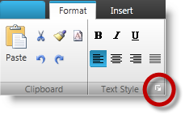
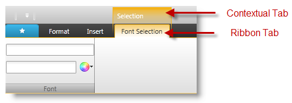
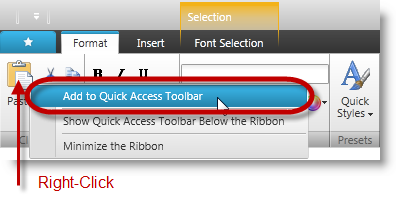
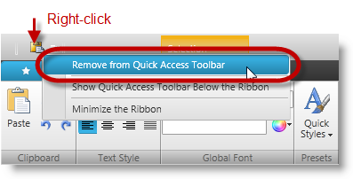
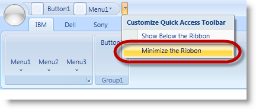
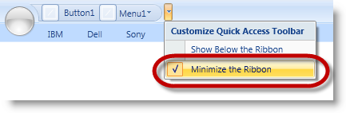
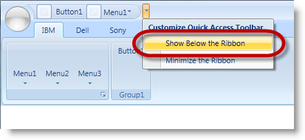
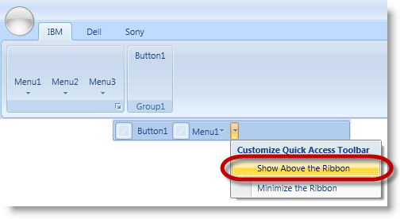

////

|metadata|
{
    "name": "xamribbon-recordable-methods",
    "controlName": [],
    "tags": [],
    "guid": "7bea184c-b707-4920-9efe-0f7daea56efe",  
    "buildFlags": [],
    "createdOn": "2013-04-19T13:57:41.9493622Z"
}
|metadata|
////

= xamRibbon - Recordable Methods

== Topic Overview

=== Purpose

This topic provides information about the  _xamRibbon_™ control’s testable user recordable and replay-able methods.

=== In this topic

This topic contains the following sections:

* <<_Ref338260000, _XamRibbon_   Recordable Methods>>

** <<_Ref353975872, _OpenGroupDialog_  >>
** <<_Ref353975881, _SelectTab_  >>
** <<_Ref353459970, _PerformToolAaction_  >>
** <<_Ref353975941, _ToggleAddToQAT_  >>
** <<_Ref353975952, _ToggleMinimizeRibbon_  >>
** <<_Ref353975963, _ToggleQATLocation_  >>

* <<_Ref337132389,Related Content>>

[[_Ref338260000]]
== _XamRibbon_   Recordable Methods

[[_Ref353975872]]
== _OpenGroupDialog_

=== Description

This action launches the  _DialogBoxLauncherTool_   of a  _RibbonGroup_  .

=== Parameters

The following table explains the method’s parameter followed by code example.

[options="header", cols="a,a"]
|====
|Method parameter|Description

| _oGroupId_ 
|Unique identifier of the ribbon group among other ribbon groups. This identifier is the group’s header. 

If the group does not have a header or if the header is a duplicate, then the identifier will be the visible index of the group among other visible groups of the ribbon.

|====

=== Example

Clicking the  _DialogBoxLauncherTool_   (outlined in the above screenshot) records the following script.

[source,csharp]
----
WpfWindow("Window1").XamRibbon("xamRibbon").OpenGroupDialog ARRAY("RibbonGroup", "Format", 0, "DialogBoxLauncherTool")
----

=== Possible exceptions

The following exceptions will result from not being able to locate the  _DialogBoxLauncherTool_  :

* The  _oGroupId_   is null or missing
* The index of the ribbon group (if present) is out of range of the total existing ribbon groups
* The ribbon group (if present) does not match any of the headers of the existing ribbon groups
* The ribbon group is removed, collapsed or hidden
* The ribbon group does not have a  _DialogBoxLauncherTool_   or the  _DialogBoxLauncherTool_   is removed, collapsed or hidden in that group

[[_Ref353975881]]
== _SelectTab_

=== Description

Clicking on the selected tab of the ribbon identified by its  _oTabId_  . Selecting a  _ContextualTabGroup_   the first tab in that group is always selected by default and hence recorded as a selection of the first tab (not the  _ContextualTabGroup_  ).

The following screenshot illustrates this concept. Selecting the  _ContextualTabGroup_   will, by default, record the first RibbonTab in the group instead.

=== Parameters

The following table explains the method’s parameter followed by code example.

[options="header", cols="a,a"]
|====
|Method parameter|Description

| _oTabId_ 
|This is a unique identifier for the Ribbon tabs representing the tab header. 

If the tab does not have a header or if the header is duplicate, then the identifier will be the visible index of the tab among other visible tabs of the ribbon.

|====

=== Example

Clicking the contextual tab called “Selection” (Illustrated in the above screenshot) records the first ribbon tab instead.

[source,csharp]
----
WpfWindow("Window1").XamRibbon("xamRibbon").SelectTab "Font Selection"
----

=== Possible exceptions

The following exceptions will result from not being able to locate the tab:

* If the  _oTabId_   is null or missing
* The tab index (if present) is out of range of the total existing tabs
* The header (if present) does not match any of the headers of the existing tabs
* The tab is removed, collapsed or hidden

[[_Ref338271984]]
[[_Ref352172238]]
[[_Ref353459970]]
== _PerformToolAction_

=== Description

This method performs Click, SelectValue, SetValue, Activate, DropDown, CloseUp actions on an IRibbonTool located within an ApplicationMenu, QuickAccessToolbar or a RibbonGroup within the selected tab. DropDown ToolAction is a ReplayOnly action except for the ApplicationMenu and QuickCustomizeMenu drop down. CloseUp is a ReplayOnly action

=== Parameters

The following table explains the method’s parameter followed by code example.

[options="header", cols="a,a"]
|====
|Method parameter|Description

| _oToolAction_ 
|This is an enumeration used to identify the type of action performed on a Ribbon tool. 

The enumerated values are: 

* Click = 0 

* SelectValue = 1 

* SetValue–=2 

* Activate =3 

* DropDown = 4 

* CloseUp = 5 

| _oToolPath_ 
|This is an array representing the entire tool path; helpful in identifying the tool. 

The first parameter of the array is the location of the tool representing one of the following string values: 

* ApplicationMenuLeftArea 

* ApplicationMenuRecentItems 

* ApplicationMenuFooterToolbar 

* QuickAccessToolbar 

* QuickCustomizeMenu 

* RibbonGroup 

* ApplicationMenu (Used only with DropDown) 

The intermediate parameters are the headers or visible indices of the root and intermediate tools; helpful in reaching the specific tool (last parameter). 

The last parameter is the tool identifier which is the header of the tool, or its visible index (if the tool has no header or the header is a duplicate with another tool at the same level).

| _oToolValue_ 
|This is the new value of the editor based tool. Its value depends on the following conditions: 

1. If the tool is a Text editor base tool, it represents the value in the textbox of that tool. 

2. If the tool is a ComboEditor tool, it represents the selected item from the ComboBox dropDown. 

3. If the tool is a ToggleButton, it represents one of following values: 

* Check 

* Uncheck 

* Indeterminate 

|====

=== Example

Clicking on a  _ButtonTool_   with header “Copy” located in  _RibbonGroup_   with header “Group1” in a tab with header “Tab1”.

[source,csharp]
----
XamRibbon(RibbonName).PerformToolAction 
Click, ARRAY("RibbonGroup", "Tab1", "Group1", "Copy")
----

Clicking on a  _RadioButtonTool_   with header “RadioButton” located in  _RibbonGroup_   with header “Group1” located in  _QuickAccessToolbar_  .

[source,csharp]
----
XamRibbon(RibbonName).PerformToolAction 
Click, ARRAY("QuickAccessToolbar", "Group1", "RadioButton")
----

Clicking on a  _LabelTool_   with header “Label” located in  _RibbonGroup_   with header “Group1” located in  _ApplicationMenuRecentItems_   area.

[source,csharp]
----
XamRibbon(RibbonName).PerformToolAction 
Click, ARRAY("ApplicationMenuRecentItems", "Group1", "Label")
----

Setting value as “Hello” on a  _TextEditorTool_   with header “Text editor” located in  _RibbonGroup_   with header “Group2” in a tab with header “Tab1”.

[source,csharp]
----
XamRibbon(RibbonName).PerformToolAction 
SetValue, ARRAY("RibbonGroup", "Tab1", "Group2", "Text editor"), "Hello”
----

Setting value as “Hi” on a  _MaskedEditorTool_   with header “Masked editor” located in  _RibbonGroup_   with header “Group2” in a tab with header “Tab1”.

[source,csharp]
----
XamRibbon(RibbonName).PerformToolAction 
SetValue, ARRAY("RibbonGroup", "Tab1", "Group2", "Masked editor"), "Hi”
----

Selecting value “One” from  _ComboEditorTool_   with header “Combo editor” located in  _RibbonGroup_   with header “Group2” in a tab with header “Tab1”.

[source,csharp]
----
XamRibbon(RibbonName).PerformToolAction 
SelectValue, ARRAY("RibbonGroup", "Tab1", "Group2", "Combo editor"), "One"
----

Clicking to activate a  _GalleryItem_   with header “GalleryItem1” located in a  _MenuTool_   with header “GalleryTool” within a  _RibbonGroup_   with header “Group2” in a tab with header “Tab1”.

[source,csharp]
----
XamRibbon(RibbonName).PerformToolAction 
Activate, ARRAY("RibbonGroup", "Tab1", "Group2", “GalleryTool”, "GalleryItem1")
----

Selecting a tool from  _GalleryItem_   with header “GalleryItem1” located in a  _MenuTool_   with header “GalleryTool” within a  _RibbonGroup_   with header “Group2” in a tab with header “Tab1”.

[source,csharp]
----
XamRibbon(RibbonName).PerformToolAction 
SelectValue, ARRAY("RibbonGroup", "Tab1", "Group2", “GalleryTool”, "GalleryItem1")
----

Clicking on a  _GalleryItem_   with header “GalleryItem1” located in a  _MenuTool_   with header “GalleryTool” within a  _RibbonGroup_   with header “Group2” in Tab with header “Tab1”.

[source,csharp]
----
XamRibbon(RibbonName).PerformToolAction 
Click, ARRAY("RibbonGroup", "Tab1", "Group2", “GalleryTool”, "GalleryItem1")
----

Clicking an  _ApplicationMenu_   button to open its DropDown menu.

[source,csharp]
----
XamRibbon(RibbonName).PerformToolAction 
DropDown, “ApplicationMenu”
----

Clicking the  _QuickCustomizeMenu_   tool to open its DropDown menu.

[source,csharp]
----
XamRibbon(RibbonName).PerformToolAction 
DropDown, “QuickCustomizeMenu”
----

Clicking the  _ButtonTool_   with header “Button” located in  _RibbonGroup_   with header “Group3” in a tab with header “Tab2” to open its DropDown menu.

[source,csharp]
----
XamRibbon(RibbonName).PerformToolAction 
DropDown, ARRAY("RibbonGroup", "Tab2", "Group3", "Button")
----

Clicking the  _ButtonTool_   with header “ButtonDrop” located in  _ApplicationMenuLeftArea_   to open its DropDown menu.

[source,csharp]
----
XamRibbon(RibbonName).PerformToolAction 
DropDown, ARRAY("ApplicationMenuLeftArea", "ButtonDrop")
----

Clicking the  _ButtonTool_   with header “Button” located in  _RibbonGroup_   with header “Group3” in a tab with header “Tab2” to close its DropDown menu.

[source,csharp]
----
XamRibbon(RibbonName).PerformToolAction 
CloseUp, ARRAY("RibbonGroup", "Tab2", "Group3", "Button")
----

Clicking the  _ButtonTool_   with header “ButtonDrop” located in  _ApplicationMenuLeftArea_   to close its DropDown menu.

[source,csharp]
----
XamRibbon(RibbonName).PerformToolAction 
CloseUp, ARRAY("ApplicationMenuLeftArea", "ButtonDrop")
----

=== Possible exceptions

The following exceptions will result from not being able to locate a tool:

* Missing or null value for either the  _oToolAction_   or  _oToolPath_  
* Entering an invalid path format for identifying the tool
* Specifying an invalid  _oToolAction_  
* Specifying an invalid  _oToolPath_   root location, invalid headers or indices that are out of range of the total existing tools at that level.
* Removing, hiding or collapsing one or more tools in the  _oToolPath_   intermediate path
* Missing or invalidating the  _oToolValue_   for that specific editor control, or changing the value is not allowed for the control
* Performing  _SetValue_   or  _SelectValue_   on tools other than those allowed (such as  _TextEditorTool_  ,  _ComboEditorTool_   or  _ToggleButtonTool_  )

[[_Ref353975941]]
== _ToggleAddToQAT_

=== Description

This method records the right-click action on tools to be added or removed from the QAT.

Adding a tool to the QAT

Removing a tool from the QAT

=== Parameters

The following table explains the method’s parameter followed by code example.

[options="header", cols="a,a"]
|====
|Method parameter|Description

| _oToolPath_ 
|This is an array representing the entire path; helpful in identifying the tool. 

The *first* parameter of the array is the location of the tool representing one of the following string values: 

* QuickAccessToolbar 

* QuickCustomizeMenu 

The *intermediate* parameters are the headers or visible indices of the root and intermediate tools, which help in reaching the specific tool (last parameter). 

The *last* parameter is the tool identifier representing the tool’s header, or its visible index (if the tool has no header or the header is a duplicate with another tool at that level).

| _bAddToQAT_ 
|Boolean value, where `True` indicates that the tool will be added to QAT and `false` indicates that it will be removed from QAT.

|====

=== Example

_ButtonTool_   with header “Button” located in  _RibbonGroup_   with header “Group1” Located in  _QuickAccessToolba_  r:

[source,csharp]
----
ARRAY("QuickAccessToolbar", "Group1", "Button")
----

_ToggleButtonTool_   with header “Toggle1” located in the  _QuickCustomizeMenu_  :

[source,csharp]
----
ARRAY("QuickCustomizeMenu", "Toggle1”)
----

=== Possible exceptions

The following exceptions will result from not being able to locate the tool:

* The  _oToolPath_   is null or missing.
* The  _oToolPath_   contains invalid headers or indices which are out of range of the total existing tools at that level.
* One or more tools in the intermediate path of the  _oToolPath_   were removed, hidden or collapsed.
* Attempting to remove a tool from QAT, while the tool is not in QAT
* Attempting to remove a tool from QAT if the Add/Remove from QAT for that tool is not allowed or disabled if the tool is already added to QAT.

[[_Ref353975952]]
== _ToggleMinimizeRibbon_

=== Description

This action toggles between minimizing and restoring of the ribbon control.

Minimizing the ribbon.

Maximizing the ribbon.

=== Parameters

The following table explains the method’s parameter followed by code example.

[options="header", cols="a,a"]
|====
|Method parameter|Description

| _bMinimizeRibbon_ 
|Boolean value, with `True` indicating that the Ribbon will be minimized and `false` indicating that it will be maximized. 

Attempting to use a script to maximize or minimize the ribbon, while the ribbon is already maximized or minimized, and results in the action being ignored.

|====

=== Example

Selecting “Minimize the Ribbon” from QAT drop-down sets the  _ToggleMinimizeRibbon_   to `True` and records the following script:

[source,csharp]
----
WpfWindow("Window1").XamRibbon("xamRibbon").PerformToolAction DropDown, "QuickCustomizeMenu" 
WpfWindow("Window1").XamRibbon("xamRibbon").ToggleMinimizeRibbon True
----

=== Possible exceptions

If minimizing the ribbon is not allowed and you try to minimize it anyway will result in throwing an exception stating the reason.

[[_Ref353975963]]
== _ToggleQATLocation_

=== Description

This action toggles between placing the  _QuickAccessToolBar_   below or above the ribbon groups.

Choosing to show  _QuickAccessToolbar_   below the ribbon.

Choosing to show  _QuickAccessToolbar_   above the ribbon.

=== Example

Selecting “Show Below the Ribbon” from QAT drop-down sets the  _ToggleQATLocation_   to `True` and records the following script:

[source,csharp]
----
WpfWindow("Window1").XamRibbon("xamRibbon").PerformToolAction DropDown, "QuickCustomizeMenu"
WpfWindow("Window1").XamRibbon("xamRibbon").ToggleQATLocation True
----

=== Parameters

The following table explains the method’s parameter followed by code example.

[options="header", cols="a,a"]
|====
|Method parameter|Description

| _bQATBelowRibbon_ 
|Boolean value. `True` indicates that the QAT will be placed below the ribbon groups and `false` indicates that it will be placed above the ribbon groups. 

If you try using a script to place the QAT above or below the ribbon groups, while it is already present above or below, respectively, the method ignores the action.

|====

=== Possible exceptions

None

[[_Ref337132389]]
== Related Content

=== Topics

The following topics provide additional information related to this topic.

[options="header", cols="a,a"]
|====
|Topic|Purpose

| link:xamribbon-user-actions-and-elements.html[xamRibbon - User Actions and Elements]
|This topic provides information about the user actions of the _xamRibbon_ control which you can test and the elements you can inspect.

| link:xamribbon-property-reference.html[xamRibbon - Property Reference]
|This topic provides reference information about the _xamRibbon_ control’s test object properties.

|====