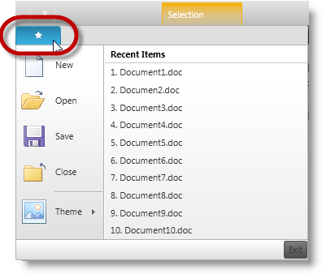
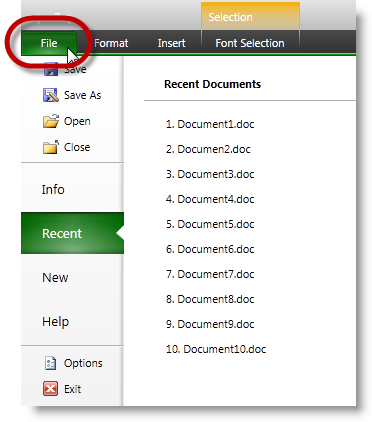
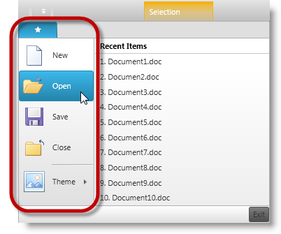
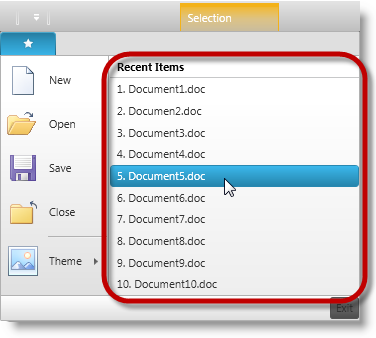
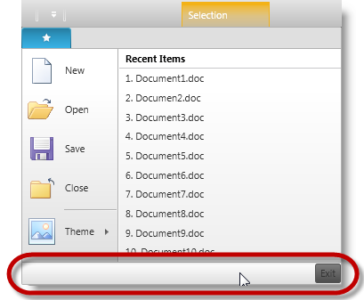
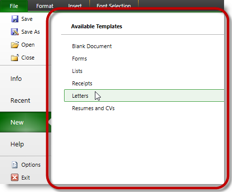
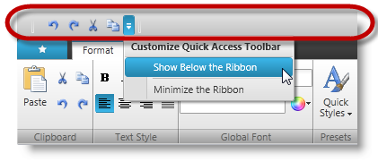
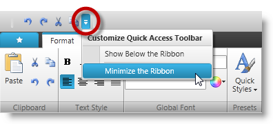
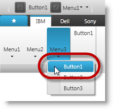
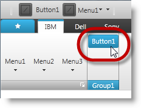

////

|metadata|
{
    "name": "xamribbon-user-actions-and-elements",
    "controlName": [],
    "tags": [],
    "guid": "da07b3ba-a8be-45b0-84e9-13daf46c5923",  
    "buildFlags": [],
    "createdOn": "2013-04-19T13:58:29.886104Z"
}
|metadata|
////

= xamRibbon - User Actions and Elements

== Topic Overview

=== Purpose

This topic provides information about the  _xamRibbon_™ control’s testable user actions and elements.

=== In this topic

This topic contains the following sections:

* <<_Ref338260068, _xamRibbon_   User Actions>>
* <<_Ref354573677, _xamRibbon_   ToolPath Areas and Elements>>

** <<_Ref354334967,ApplicationMenu>>
** <<_Ref354334978,ApplicationMenu2010>>
** <<_Ref354334988,ApplicationMenuLeftArea>>
** <<_Ref354335001,ApplicationMenuRecentItems>>
** <<_Ref354335201,ApplicaitonMenuFooterToolbar>>
** <<_Ref354573755,ApplicationMenuSelectedTab>>
** <<_Ref354335214,QuickAccessToolbar>>
** <<_Ref354335223,QuickCustomizeMenu>>
** <<_Ref354335235,RibbonGroup>>

* <<_Ref337132389,Related Content>>

[[_Ref338260068]]
== _xamRibbon_   User Actions

=== Testable user action chart

The following table summarizes the control’s user action and maps it to the recordable methods that emulate the action.

[options="header", cols="a,a"]
|====
|User action|Method

|Launching the ribbon group’s dialog box.
| link:{ApiPlatform}test.ribbon~infragisticswpf.test.ribbon.xamribbonproxy~opengroupdialog.html[OpenGroupDialog]

|Performing one of the following actionswithin an _ApplicationMenu_, _QuickAccessToolbar(QAT)_ or a _RibbonGroup_ of a selected tab: 

* _Click_ 

* _SelectValue_ 

* _SetValue_ 

* _Activate_ 

* _DropDown_ 

* _CloseUp_ 

| link:{ApiPlatform}test.ribbon~infragisticswpf.test.ribbon.xamribbonproxy~performtoolaction.html[PerformToolAction]

|Clicking on the ribbon tab to select.
| link:infragisticswpf.test.ribbon~infragisticswpf.test.ribbon.xamribbonproxy~selecttab.html[SelectTab]

|Toggling between adding and removing the tool to and from the _QAT_ . 

No right click action is recorded.
| link:{ApiPlatform}test.ribbon~infragisticswpf.test.ribbon.xamribbonproxy~toggleaddtoqat.html[ToggleAddToQAT]

|Toggling between minimizing and restoring the ribbon control. 

No right click action is recorded.
| link:{ApiPlatform}test.ribbon~infragisticswpf.test.ribbon.xamribbonproxy~toggleminimizeribbon.html[ToggleMinimizeRibbon]

|Toggling between placing the _QAT_ below or above the ribbon groups. 

No right click action is recorded.
| link:{ApiPlatform}test.ribbon~infragisticswpf.test.ribbon.xamribbonproxy~toggleqatlocation.html[ToggleQATLocation]

|====

[[_Ref354573677]]
== _xamRibbon_   ToolPath Areas and Elements

=== Overview

ToolPath consists of several areas in  _xamRibbo_  n, each housing elements and items that can be recorded and inspected via UFT tool. More details about each ToolPath action are listed in subsequent sections with brief descriptions and screenshots outlining the affected areas or elements.

[[_Ref354334967]]

=== ApplicationMenu

The  _ApplicationMenu,_   illustrated below, is the top-left section of the  _xamRibbon_   control with a button to drop-down a menu with items and elements.

[[_Ref354334978]]

=== ApplicationMenu2010

The  _ApplicationMenu2010_   is the new style added to the release of 2013 volume 1 of the  _Ultimate UI for WPF xamRibbon_   with slightly different layout than the early  _ApplicationMenu_  .

It also features with drop-down button (top-left), which opens up its menu with recent items and elements.

[[_Ref354334988]]

=== ApplicationMenuLeftArea

This area may contain list of items and their contents which may consist of collection of items on their own. The items function as buttons responding to click events, or may simply be used for navigating to its items’ collection on the right pane of the menu.

==== ApplicationMenuLeftArea of the ApplicationMenu

Clicking the (Open) button in the  _ApplicationMenuLeftArea_   records the following script.WpfWindow("Window1").WpfMenu("WpfMenu").Select "Open" WpfWindow("Window1").XamRibbon("RibbonName").PerformToolAction Click, ARRAY("ApplicationMenuLeftArea", "Open")

==== ApplicationMenuLeftArea of the ApplicationMenu2010.

image::images/xamRibbon_User_Actions_and_Elements_4.png[]

Clicking the (Recent) menu tab in the  _ApplicationMenuSelectedTab_   area of the  _ApplicationMenuLeftArea_   records the following script.

[source,csharp]
----
WpfWindow("Window1").XamRibbon("RibbonName").PerformToolAction Click, ARRAY("ApplicationMenuLeftArea", "Recent")
----

[[_Ref354335001]]

=== ApplicationMenuRecentItems

There is a slight difference displaying recent items in  _ApplicationMenu_   compared to  _ApplicationMenu2010._   When the recent items menu is defined,  _ApplicationMenu_   displays the recent items list (on the right) as soon as the menu drops down.

[[_Ref354335201]]

=== ApplicaitonMenuFooterToolbar

_ApplicationMenuFooterToolbar,_   located at the bottom section of the dropped-down menu. This section is typically used as a button to exit out of and close the menu.

[[_Ref354573755]]

=== ApplicationMenuSelectedTab

The following screenshot illustrates the  _ApplicationMenuSelectedTab_   area.

If an  _ApplicationMenu2010_   Item (New) is clicked, its content is displayed in the  _ApplicationMenuSelectedTab_   area (on the right).

[[_Ref354335214]]

=== QuickAccessToolbar

This area allows for quick access of the existing items. It is positioned above  _RibbonTabItems_   by default and has the option to show below the ribbon.

[[_Ref354335223]]

=== QuickCustomizeMenu

This is the drop-down button that opens up the customizable menu with available options.

[[_Ref354335235]]

=== RibbonGroup

The ribbon groups are defined within each ribbon tab, which may consist of tools for each category in  _RibbonGroup_  .

Clicking the “Button1” in “Menu3” drop-down of the  _RibbonGroup_   inside “IBM” tab will record the following script.

[source,csharp]
----
WpfWindow("Window1").XamRibbon("xamRibbon").PerformToolAction Click, ARRAY("RibbonGroup", "IBM", 0, "Menu3", "Button1")
----

Clicking the “Button1” tool in “Group1” of the RibbonGroup will record the following script.

[source,csharp]
----
WpfWindow("Window1").XamRibbon("xamRibbon").PerformToolAction Click, ARRAY("RibbonGroup", "IBM", "Group1", "Button1")
----

[[_Ref337132389]]
== Related Content

=== Topics

The following topics provide additional information related to this topic.

[options="header", cols="a,a"]
|====
|Topic|Purpose

| link:xamribbon-recordable-methods.html[xamRibbon - Recordable Methods]
|This topic provides reference information about the recordable user methods for testing the _XamRibbon_ control.

| link:xamribbon-property-reference.html[xamRibbon - Property Reference]
|This topic provides reference information about the _XamRibbon_ control’s test object properties.

|====